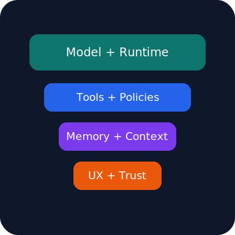
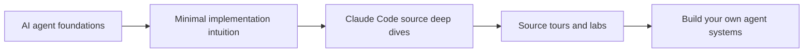

# Relearn Claude Code

[](https://leehongji.github.io/Relearn-Claude-Code/)
[](./docs)
[](./docs/zh/index.md)
[](./RELEASE_NOTES.md)

> A source-grounded, English-first, bilingual teaching platform for understanding **Claude Code**, **AI coding agents**, and the engineering patterns behind production-grade developer tools.

<p align="center">
  <a href="https://leehongji.github.io/Relearn-Claude-Code/"><strong>🌐 Read the site</strong></a>
  &nbsp;&nbsp;·&nbsp;&nbsp;
  <a href="./PR_DESCRIPTION.md"><strong>📝 PR-style summary</strong></a>
  &nbsp;&nbsp;·&nbsp;&nbsp;
  <a href="./RELEASE_NOTES.md"><strong>📦 Release notes</strong></a>
</p>

<p align="center">
  
</p>

## Why this project exists

Claude Code is large enough that most people hit one of two failure modes:

1. **Beginners** get lost in the sheer size of the codebase.
2. **Experienced engineers** can navigate the repo, but still want a cleaner map of what matters and why.

This repo exists to bridge that gap.

It teaches:

- what an AI coding agent is,
- how Claude Code’s runtime is structured,
- how tools, permissions, memory, and UI fit together,
- and how to extract reusable architecture lessons for your own agent systems.

## Project tags

`AI Agents` · `Claude Code` · `Coding Agents` · `TypeScript` · `VitePress` · `Source Tours` · `LLM Systems` · `Prompt Engineering` · `Tooling` · `Memory` · `Permissions` · `MCP` · `LSP`

## Learning model



## What makes this repo different

### 1. English-first, but bilingual

The main learning path is written in English for broad accessibility, while `docs/zh/` provides Chinese support pages and mirrored navigation where it helps the most.

### 2. Source-grounded, not speculative

The explanations are anchored to concrete source areas under `../ref_repo/claude-code`, supported by:

1. `claude-code` — the primary subject
2. `how-claude-code-works` — topic-oriented architecture explanations
3. `claude-code-from-scratch` — the minimal teaching implementation

### 3. Built for both beginners and senior engineers

The site is intentionally layered:

- **Foundations** for readers new to agent systems
- **Deep dives** for architecture-level understanding
- **Source tours** for repo navigation
- **Labs** for implementation practice

## Current site map

| Section              | Purpose                                                |
| -------------------- | ------------------------------------------------------ |
| `docs/foundations/`  | AI agent basics, loop, context, tools, safety          |
| `docs/claude-code/`  | Source-grounded deep dives into Claude Code subsystems |
| `docs/source-tours/` | Execution-path reading guides                          |
| `docs/labs/`         | Hands-on exercises                                     |
| `docs/appendix/`     | Glossary, source atlas, publishing notes               |
| `docs/zh/`           | Chinese support and mirrored entry pages               |

## Recommended reading paths

### If you are new to agents

Start with:

1. `docs/foundations/what-is-an-agent.md`
2. `docs/foundations/agent-loop.md`
3. `docs/foundations/context-memory.md`
4. `docs/foundations/tools-safety.md`

### If you want to understand Claude Code quickly

Start with:

1. `docs/claude-code/architecture.md`
2. `docs/claude-code/runtime-loop.md`
3. `docs/claude-code/tools-and-permissions.md`
4. `docs/appendix/source-atlas.md`

### If you want implementation ideas for your own agent

Start with:

1. `docs/labs/add-a-tool.md`
2. `docs/labs/compact-context.md`
3. `docs/labs/multi-agent-readiness.md`
4. `docs/claude-code/building-your-own.md`

## Advanced topics already covered

- MCP and external tools
- Skills and prompt loading
- Plugins and extension surfaces
- Tasks and orchestration
- Ink and terminal UI
- Managed settings and policy
- Overflow recovery and reactive compact
- LSP and editor intelligence

## Local development

```bash
npm install
npm run docs:dev
```

## Verification commands

```bash
npm run lint
npm test
npm run docs:build
DOCS_BASE=/demo/ npm run docs:build
```

## Deployment

- Workflow: `.github/workflows/deploy-docs.yml`
- Live site: https://leehongji.github.io/Relearn-Claude-Code/

## Repo companion files

- `RELEASE_NOTES.md` — release/changelog style summary
- `PR_DESCRIPTION.md` — reusable PR narrative
- `research/` — maintainers’ analysis artifacts
- `scripts/verify-analysis.cjs` — content verification
- `scripts/verify-docs-structure.cjs` — docs-structure verification

## Maintainer notes

- English is the canonical source path.
- Chinese support pages should improve accessibility without duplicating noise.
- `../ref_repo` is treated as read-only source evidence.
- Sequential VitePress builds are safer than concurrent ones because `.vitepress/.temp` can race during rendering.
