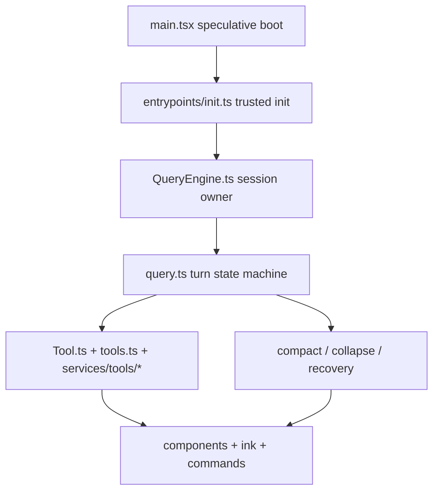

# Claude Code architecture

Claude Code is easiest to understand if you stop thinking of it as “a CLI that calls a model” and start thinking of it as a **multi-plane system**:

1. a **startup and trust plane** that prepares the environment,
2. a **session plane** that owns long-lived conversation state,
3. a **turn plane** that drives the think-act-observe loop,
4. a **tool and capability plane** that lets the model act safely,
5. a **product plane** that turns all of this into a usable terminal application.

That framing matters because many readers flatten these layers into one vague “runtime.” The source says otherwise.


## The shortest accurate mental model



The key claim of this page is simple:

> **Claude Code is not organized around “the model call.” It is organized around time horizons and control boundaries.**

- `main.tsx` is concerned with what must happen before the product is truly alive.
- `entrypoints/init.ts` is concerned with what can be safely initialized and in what order.
- `QueryEngine.ts` is concerned with what survives across many user turns.
- `query.ts` is concerned with what happens in one turn and how that turn recovers from failure.
- the tool, compact, UI, and command subsystems are each attached to those core time horizons.

## Why this codebase feels bigger than “a coding assistant”

If you compare Claude Code with a small coding-agent tutorial project, the size difference comes from more than just features. It comes from production obligations:

- startup performance,
- permission and trust management,
- persistent session state,
- failure recovery,
- multi-surface product behavior,
- extension boundaries,
- durable memory and task artifacts.

A toy agent can survive as:

```text
user input -> model -> maybe tool -> result
```

Claude Code cannot. It has to support thousands of edge conditions without losing the user’s trust.

## Plane 1 — startup and trust

Primary anchors:

- `src/main.tsx`
- `src/entrypoints/init.ts`

The first major architectural mistake many people make is to treat startup as boring boilerplate. In Claude Code, startup is already doing architecture work.

### Annotated code: speculative boot in `main.tsx`

```ts
// These side-effects must run before all other imports:
// 1. profileCheckpoint marks entry before heavy module evaluation begins
// 2. startMdmRawRead fires MDM subprocesses ... in parallel
// 3. startKeychainPrefetch fires both macOS keychain reads ... in parallel
profileCheckpoint('main_tsx_entry')
startMdmRawRead()
startKeychainPrefetch()
```

### What this means

This is not decorative optimization.

`main.tsx` is intentionally doing **speculative boot work before the full program graph is loaded**:

- measure startup,
- prefetch machine-managed settings,
- prefetch credentials,
- overlap waiting time with import time.

That is a very specific product choice:

> the system is designed so the user does not pay every startup cost in a single serial chain.

### Annotated code: trusted init in `init.ts`

```ts
applySafeConfigEnvironmentVariables()
applyExtraCACertsFromConfig()
setupGracefulShutdown()
if (isEligibleForRemoteManagedSettings()) {
  initializeRemoteManagedSettingsLoadingPromise()
}
if (isPolicyLimitsEligible()) {
  initializePolicyLimitsLoadingPromise()
}
configureGlobalMTLS()
configureGlobalAgents()
preconnectAnthropicApi()
```

### What this means

This is where startup becomes a **trust boundary**.

The runtime is deciding:

- which settings are safe to apply before trust is fully established,
- which network/certificate/proxy rules must be installed globally,
- which managed-policy systems need to begin loading immediately,
- how to prepare clean shutdown and scratchpad behavior.

This is one reason the architecture deserves a dedicated startup page: startup is not just setup, it is where the runtime establishes the environment the agent is allowed to live in.

## Plane 2 — session ownership

Primary anchor:

- `src/QueryEngine.ts`

If `main.tsx` and `init.ts` make the program safe to run, `QueryEngine.ts` makes it meaningful to have an ongoing conversation.

### Annotated code: what the engine owns

```ts
export type QueryEngineConfig = {
  cwd: string
  tools: Tools
  commands: Command[]
  mcpClients: MCPServerConnection[]
  agents: AgentDefinition[]
  canUseTool: CanUseToolFn
  getAppState: () => AppState
  setAppState: (f: (prev: AppState) => AppState) => void
  initialMessages?: Message[]
  readFileCache: FileStateCache
  customSystemPrompt?: string
  appendSystemPrompt?: string
  userSpecifiedModel?: string
  fallbackModel?: string
  thinkingConfig?: ThinkingConfig
  maxTurns?: number
  maxBudgetUsd?: number
  taskBudget?: { total: number }
}
```

### What this means

This config object is the best proof that `QueryEngine` is **session infrastructure**, not just a helper around `query()`.

It owns or coordinates:

- the working directory,
- the available tools and commands,
- active MCP clients,
- custom agents,
- the app-state bridge,
- file caches,
- prompt shaping,
- model fallback and budgets.

That is already far beyond “send messages to the model.”

### Another important clue

The class keeps long-lived mutable structures such as:

- transcript messages,
- permission denials,
- read-file state,
- discovered skill names,
- loaded nested memory paths,
- total usage.

That is exactly why `QueryEngine.ts` should be taught as **the session owner**.

## Plane 3 — turn state machine

Primary anchor:

- `src/query.ts`

If `QueryEngine` owns the conversation, `query.ts` owns the turn.

### The right way to read `query.ts`

Do **not** read it as “the place where the model call happens.”

Read it as a state machine that repeatedly decides:

- what context to send,
- whether to compact,
- how to recover from overflow,
- whether to execute tools now,
- whether to continue or terminate,
- what kind of continuation this is.

### Annotated code: feature-gated recovery surfaces

```ts
const reactiveCompact = feature('REACTIVE_COMPACT')
  ? require('./services/compact/reactiveCompact.js')
  : null
const contextCollapse = feature('CONTEXT_COLLAPSE')
  ? require('./services/contextCollapse/index.js')
  : null
```

### What this means

The turn loop is not only “call model, run tools.” It also knows about:

- context overflow,
- withheld content,
- recovery policies,
- feature-gated continuation strategies.

In other words, the turn plane is where resilience lives.

### Why the split matters

This gives us one of the most important architecture distinctions in the whole codebase:

- **session problems** belong to `QueryEngine.ts`
- **turn problems** belong to `query.ts`

If you collapse these together, you lose the ability to explain why the codebase is structured this way at all.

## Plane 4 — capability and action

Primary anchors:

- `src/Tool.ts`
- `src/tools.ts`
- `src/services/tools/*`
- `src/utils/permissions/*`

The tool plane is where the model stops being a text predictor and becomes an actor in the repository.

What matters architecturally is not only that tools exist. It is that tool use is mediated through:

- shared contracts,
- permission checks,
- concurrency policy,
- result shaping,
- optional discovery/deferred loading,
- UI rendering.

That is why this plane connects deeply to both the session plane and the turn plane.

## Plane 5 — product shell

Primary anchors:

- `src/components/*`
- `src/ink/*`
- `src/commands/*`
- `src/state/*`

Claude Code is not a backend library wearing a terminal skin. It is a product shell with:

- dialogs,
- approvals,
- task views,
- command surfaces,
- focus and cursor behavior,
- streaming presentation,
- multi-surface state.

That is why “UI” here should really be read as **product shell**.

## The best architecture simplification

If you want one sentence to carry away, use this:

> Claude Code is built around **time horizons** (boot, session, turn) and **responsibility planes** (capabilities, control, product shell), not around one giant central brain file.

## How to study the codebase with this model

### If you want the startup story

Read in order:

1. `main.tsx`
2. `entrypoints/init.ts`
3. `bootstrap/state.ts`

### If you want the runtime story

Read in order:

1. `QueryEngine.ts`
2. `query.ts`
3. `services/tools/StreamingToolExecutor.ts`
4. `services/compact/*`

### If you want the product story

Read in order:

1. `commands/*`
2. `components/*`
3. `ink/*`
4. `state/*`

## Teaching takeaway

### For beginners

Do not ask only “what does the model do?”
Ask:

- what had to happen before the model could run safely?
- what survives across turns?
- what is decided once per turn?
- what is enforced by the runtime instead of the model?

### For experienced engineers

The strongest architectural lesson is boundary design:

- boot vs trusted init,
- session vs turn,
- tool contract vs permission runtime,
- product shell vs engine.

Those seams are what make the system debuggable, extensible, and trustworthy.
