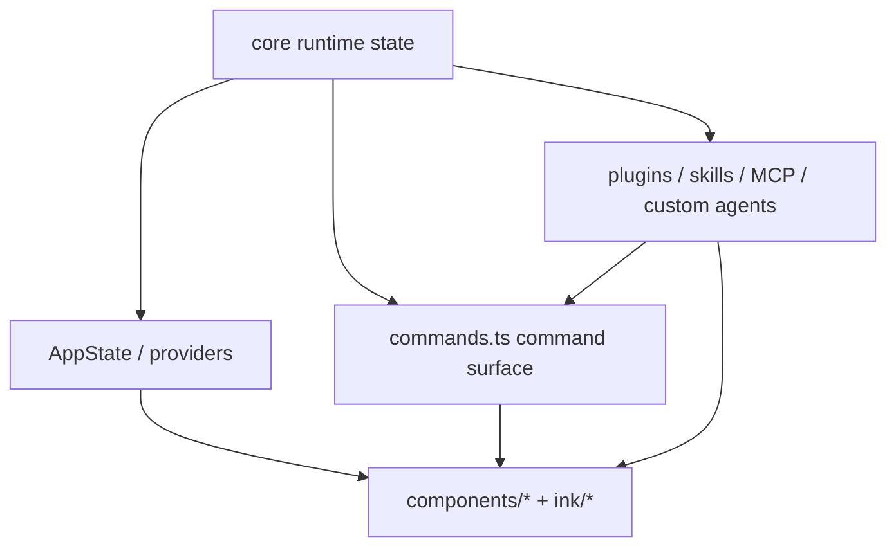

# Commands, UI, and extensions

Claude Code is not only an engine. It is a **developer product shell** wrapped around that engine.

That distinction matters.

Many readers understand:

- there is a loop,
- there are tools,
- there is some terminal UI.

Fewer readers understand the more important product question:

> **How does Claude Code turn runtime state into a usable, trustworthy developer experience while still leaving room for extension?**

This page answers that question.

## Why this page matters

If you only study the model loop, you can learn how Claude Code *thinks*.

If you study commands, UI, and extension boundaries, you learn how Claude Code becomes:

- explorable,
- interruptible,
- configurable,
- extensible,
- and worth using as a daily product.

That is the difference between an agent runtime and an agent product.

## Main source anchors

- `src/commands.ts`
- `src/components/App.tsx`
- `src/ink/components/App.tsx`
- `src/components/tasks/*`
- `src/components/permissions/*`
- `src/services/plugins/pluginOperations.ts`
- `src/cli/handlers/plugins.ts`

## Product-shell map



This is the central idea:

Claude Code does not expose its runtime directly.
It wraps the runtime in a **product shell** made of commands, app state, UI primitives, and extension boundaries.

## Part 1 — `commands.ts` is the product verb registry

At first glance, `commands.ts` is just a very large import-and-export file.

Architecturally, it is much more useful to read it as:

> the canonical list of user-facing verbs the product chooses to expose.

### Annotated code

```ts
import memory from './commands/memory/index.js'
import mcp from './commands/mcp/index.js'
import review from './commands/review.js'
import skills from './commands/skills/index.js'
import tasks from './commands/tasks/index.js'
import plugin from './commands/plugin/index.js'
```

and later:

```ts
const bridge = feature('BRIDGE_MODE')
  ? require('./commands/bridge/index.js').default
  : null
```

### What this means

The command layer is doing two things at once:

1. defining the **user-visible command language**,
2. acting as a product-level feature gate surface.

That means commands are not just convenience wrappers.
They are how the product decides:

- which runtime capabilities deserve explicit verbs,
- which features are advanced/internal/feature-gated,
- which flows should be user-driven instead of purely model-driven.

## Part 2 — commands are a shell around the engine, not a side feature

This is one of the most important product lessons in the repo.

A weaker product would push everything through free-form prompting:

```text
user asks model -> model figures it out
```

Claude Code does not rely only on that.

It gives users explicit control surfaces like:

- `/memory`
- `/compact`
- `/mcp`
- `/tasks`
- `/skills`
- `/review`
- `/plugin`

Why? Because some actions are better represented as **product verbs** than as ambiguous natural-language requests.

This lowers ambiguity and improves trust.

## Part 3 — `components/App.tsx` and `ink/components/App.tsx` define the shell boundary

These files are not “just React wrappers.”

They are the beginning of the product shell.

### Annotated code: high-level app wrapper

```ts
export function App({
  getFpsMetrics,
  stats,
  initialState,
  children,
}: Props): React.ReactNode {
  return (
    <FpsMetricsProvider getFpsMetrics={getFpsMetrics}>
      <StatsProvider store={stats}>
        <AppStateProvider
          initialState={initialState}
          onChangeAppState={onChangeAppState}
        >
          {children}
        </AppStateProvider>
      </StatsProvider>
    </FpsMetricsProvider>
  )
}
```

### What this means

This wrapper tells you exactly what the product shell thinks is globally important:

- app state,
- metrics,
- stats,
- change propagation.

In other words, the runtime is not merely “rendered.”
It is surrounded by shared product contexts.

### Annotated code: terminal-native shell behavior

`src/ink/components/App.tsx` is where the shell becomes terminal-specific.

Important concerns visible there include:

- raw mode handling,
- cursor visibility,
- focus and hover state,
- keyboard dispatch,
- click and selection tracking,
- terminal resume after long stdin gaps.

That means the terminal shell is not just text output.
It is a real interaction runtime.

## Part 4 — terminal UX is a trust mechanism

This is where the user-experience chapter in `how-claude-code-works` is especially helpful as a quality reference.

Claude Code’s UI is not only “pretty terminal output.”
It is how the product makes autonomous behavior:

- visible,
- interruptible,
- debuggable,
- reviewable.

Examples:

- permission dialogs,
- task detail dialogs,
- background status pills,
- scrolling output,
- link/click behavior,
- focus-aware rendering,
- explicit shell / tool progress messages.

That is why terminal UX belongs in architecture discussions.

## Part 5 — app state is where runtime becomes product

The shell depends on a strong state boundary.

`AppState` and related state/update surfaces are where:

- permission mode,
- tasks,
- teammate state,
- MCP resources,
- plugin state,
- prompt suggestions,
- sandbox status

become coherent enough to drive the interface.

This is an important seam:

> runtime subsystems own the truth, but app state is what makes that truth visible and navigable.

That is why UI pages should never be written as if they are disconnected from orchestration or permissions.

## Part 6 — tasks are the clearest product-shell example

One of the best examples of the runtime→product seam is the task subsystem.

The pattern looks like this:

```mermaid
flowchart LR
  runtime_task[task state in runtime] --> dialog[/tasks command]
  dialog --> components[task dialog + footer pills]
  components --> user[visible work / selectable work / teammate views]
```

The product shell does not invent task state on its own.
It **projects** runtime task state into:

- commands,
- dialogs,
- footer summaries,
- detail panes,
- teammate navigation.

That is exactly the pattern to look for across the rest of the product.

## Part 7 — extensions are separated because `query.ts` cannot own everything

Claude Code exposes multiple extension surfaces:

| Surface | What it extends |
| --- | --- |
| Commands | explicit user verbs |
| Skills | reusable workflows |
| Plugins | packaged product extensions |
| MCP | external tool/resource protocol |
| Custom agents | specialized behavior/persona surfaces |

The architectural lesson is not only “there are many extension types.”

It is:

> the product deliberately uses different extension boundaries for different jobs.

This prevents everything from collapsing into one giant hook or one giant plugin mechanism.

## Part 8 — plugin operations show lifecycle discipline

`pluginOperations.ts` is a good example of extension design done carefully.

### Annotated code

```ts
/**
 * Core plugin operations (install, uninstall, enable, disable, update)
 *
 * Functions in this module:
 * - Do NOT call process.exit()
 * - Do NOT write to console
 * - Return result objects indicating success/failure with messages
 */
```

### What this means

This file is teaching a very useful discipline:

- core operations are pure-ish library functions,
- CLI wrappers live elsewhere,
- UI can also reuse the same operations,
- lifecycle logic is centralized instead of duplicated.

That separation is exactly what makes plugin handling a real product subsystem instead of scattered CLI code.

## Part 9 — why this all belongs in one article

At first, commands, UI, and extension surfaces may feel like separate topics.

But architecturally they belong together because they all answer the same question:

> how does Claude Code expose internal capability to the human user, and how does it widen that capability without turning the core loop into a mess?

That is the unifying idea of the product shell.

## Part 10 — what builders should steal

### For beginners

Steal these product lessons:

1. not every capability should be a prompt,
2. explicit commands reduce ambiguity,
3. UI is part of trust, not only part of style,
4. extension surfaces should be named and purposeful.

### For advanced readers

Steal these architectural lessons:

1. keep core operations separate from CLI/console side effects,
2. let app state translate runtime truth into product UX,
3. use multiple extension boundaries instead of one catch-all hook system,
4. treat terminal UI as a real interaction runtime.

## Teaching takeaway

The best one-sentence summary is:

> Claude Code’s commands, UI, and extensions together form a **product shell** that makes the runtime visible, operable, and extensible.

That shell is not peripheral. It is one of the core reasons the system feels like a serious engineering product instead of a hidden model loop.
