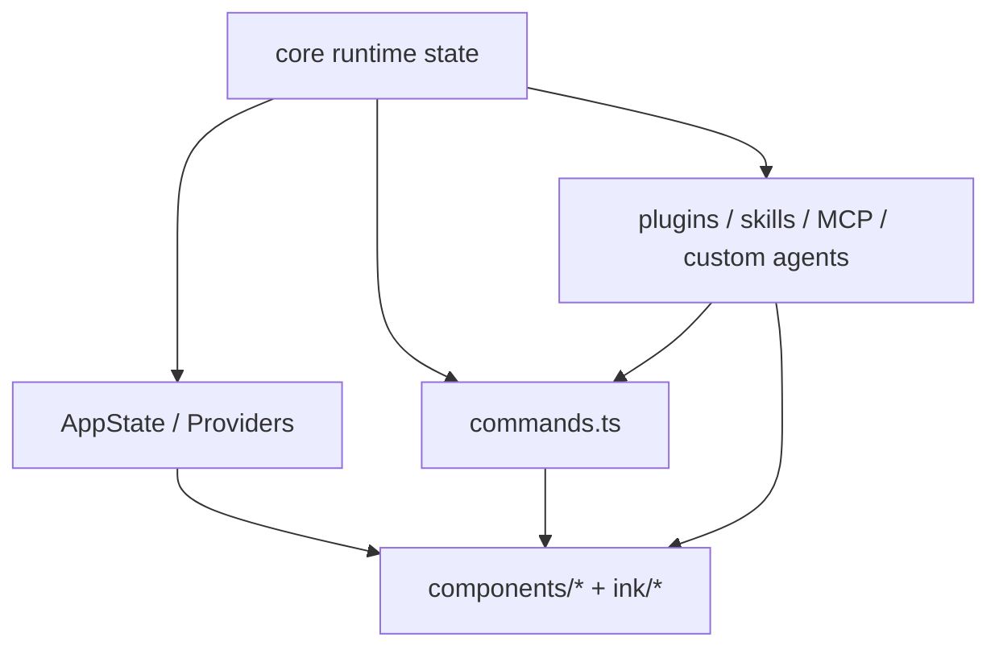

# Commands, UI, and extensions

Claude Code is not only an engine. It is a **product shell** wrapped around that engine.

That product shell is what makes the system:

- operable,
- visible,
- interruptible,
- configurable,
- and extensible.

This page is about a deeper idea than “there are slash commands and some UI.”

> **Commands, terminal UI, and extension surfaces are the layer that turns internal runtime state into a usable developer product.**

If you skip this layer, Claude Code looks like a smart loop with tools.
If you study it, Claude Code starts to look like a real software product.

## Why this page matters

A serious agent product cannot leave everything to free-form prompting.

Users need:

- explicit commands,
- visible state,
- inspectable progress,
- recoverable workflows,
- controlled extension points.

Claude Code’s command shell, Ink/React UI, and plugin/skill/MCP surfaces exist to solve those problems.

## Main source anchors

- `src/commands.ts`
- `src/components/App.tsx`
- `src/ink/components/App.tsx`
- `src/components/tasks/*`
- `src/components/permissions/*`
- `src/cli/handlers/plugins.ts`
- `src/services/plugins/pluginOperations.ts`

## Product-shell map



This is the key architectural claim:

Claude Code does not expose its runtime directly.
It wraps the runtime in a product shell that decides:

- which user-facing verbs exist,
- how state becomes visible,
- how extension surfaces are allowed to widen the product.

## Part 1 — `commands.ts` is the product verb registry

At first glance, `commands.ts` looks like a huge import list.

Architecturally, it is better read as:

> the canonical list of **product verbs** that Claude Code chooses to make explicit.

### Annotated code

```ts
import memory from './commands/memory/index.js'
import mcp from './commands/mcp/index.js'
import review, { ultrareview } from './commands/review.js'
import skills from './commands/skills/index.js'
import tasks from './commands/tasks/index.js'
import plugin from './commands/plugin/index.js'
```

### What this means

These imports are not random convenience commands.
They are the features the product wants to expose as explicit user operations:

- inspect or manage memory,
- manage MCP state,
- run review flows,
- browse skills,
- manage background tasks,
- manage plugins.

That means commands are doing product design work:

- deciding what should be explicit,
- reducing ambiguity for the user,
- and preventing every action from having to be inferred from prose.

### Feature-gated command surfaces

The file also includes many feature-gated commands:

```ts
const bridge = feature('BRIDGE_MODE')
  ? require('./commands/bridge/index.js').default
  : null

const workflowsCmd = feature('WORKFLOW_SCRIPTS')
  ? require('./commands/workflows/index.js').default
  : null
```

This teaches an important lesson:

> product verbs are part of the rollout surface.

Commands are not only runtime wiring. They are part of the product’s public contract, so the repo treats them with the same feature-gating discipline it uses elsewhere.

## Part 2 — commands sit above the engine, not inside it

If the model loop were the only interface, users would have to phrase everything as natural language:

```text
please compact the conversation
please show background tasks
please inspect plugins
```

Claude Code instead offers direct verbs like:

- `/compact`
- `/tasks`
- `/plugin`
- `/skills`
- `/mcp`

That means commands are a **shell around the engine**.

The engine remains model-centric.
The command layer gives users a precise product language for interacting with that engine.

## Part 3 — `components/App.tsx` shows what the shell considers globally important

This file is small, but its structure is revealing.

### Annotated code

```ts
export function App({
  getFpsMetrics,
  stats,
  initialState,
  children,
}: Props): React.ReactNode {
  return (
    <FpsMetricsProvider getFpsMetrics={getFpsMetrics}>
      <StatsProvider store={stats}>
        <AppStateProvider
          initialState={initialState}
          onChangeAppState={onChangeAppState}
        >
          {children}
        </AppStateProvider>
      </StatsProvider>
    </FpsMetricsProvider>
  )
}
```

### What this means

Before the visible UI even renders, the shell is establishing:

- app state,
- stats,
- metrics,
- centralized app-state change handling.

So the shell is not merely visual.
It is setting up the **shared product context** that the rest of the terminal UI depends on.

## Part 4 — `ink/components/App.tsx` proves the terminal is a real interaction runtime

This file is one of the best reminders that terminal UI is not “just print text.”

It handles concerns like:

- raw mode,
- cursor visibility,
- focus and hover state,
- keyboard dispatch,
- selection drag,
- hyperlink open behavior,
- incomplete escape-sequence timing,
- terminal resume after long gaps,
- alternate-screen and mouse-tracking interactions.

### What this means

Claude Code’s terminal shell is doing many of the same jobs a browser UI runtime would do:

- normalize events,
- maintain focus state,
- coordinate input and rendering,
- preserve interaction invariants.

That is why `ink` should be read as infrastructure, not ornament.

## Part 5 — UI is how trust becomes visible

One of the most important lessons from `components/tasks/*` and `components/permissions/*` is that trust is not only a backend concern.

The user needs to see:

- what the system is doing,
- whether it is waiting on approval,
- what background work exists,
- what teammate or task context is active,
- whether a command or task is still progressing.

That is why tasks, permissions, and dialogs belong in a “commands/UI/extensions” architecture page.

The product shell is where internal state becomes legible.

## Part 6 — tasks are a perfect example of runtime → shell projection

The task subsystem is one of the clearest examples of this shell boundary:

```mermaid
flowchart LR
  runtime_task[durable task state] --> command[/tasks]
  command --> dialog[BackgroundTasksDialog]
  dialog --> footer[BackgroundTaskStatus footer pills]
  footer --> user[visible progress / teammate views]
```

This pattern matters:

- runtime owns the truth,
- commands provide an entry point,
- UI projects the truth into something the user can inspect and navigate.

That is the design pattern to look for across the rest of the product shell.

## Part 7 — extension boundaries exist because the loop cannot own everything

Claude Code exposes several extension surfaces:

| Surface | Main purpose |
| --- | --- |
| Commands | explicit user verbs |
| Skills | reusable workflows and prompts |
| Plugins | packaged extension lifecycle |
| MCP | external tool/resource connectivity |
| Custom agents | specialized role/capability surfaces |

The important architecture lesson is not that there are many extension types.

It is that Claude Code does **not** try to solve every extension problem with one abstraction.

That is a sign of maturity.

Different extension surfaces exist because they solve different problems:

- commands expose product verbs,
- skills capture workflow knowledge,
- plugins manage lifecycle and installation,
- MCP handles external capability bridges,
- custom agents encapsulate role-specific behaviors.

## Part 8 — `pluginOperations.ts` shows lifecycle discipline

This file is especially useful because it documents the intended separation between product shell and core operations.

### Annotated code

```ts
/**
 * Core plugin operations (install, uninstall, enable, disable, update)
 *
 * This module provides pure library functions that can be used by both:
 * - CLI commands
 * - Interactive UI
 *
 * Functions in this module:
 * - Do NOT call process.exit()
 * - Do NOT write to console
 * - Return result objects
 */
```

### What this means

This is excellent product architecture:

- core operations are reusable,
- CLI behavior is layered on top,
- UI behavior is layered on top,
- side effects like process exit and console output stay outside the operation core.

That means plugin lifecycle logic is portable across multiple product surfaces.

This is exactly the kind of design that keeps a product shell maintainable.

## Part 9 — why this page should stay unified for now

At some point, these topics may become multiple deeper chapters:

- commands as product shell,
- terminal UX / Ink runtime,
- extension boundaries.

But for now, it is still valuable to teach them together because they answer the same system question:

> how does Claude Code expose internal capability to a human user without collapsing the core runtime into a giant monolith?

That is the unifying seam.

## Part 10 — what builders should steal

### For beginners

Steal these product lessons:

1. not every capability should be hidden behind prompting,
2. explicit commands reduce ambiguity,
3. terminal UI is part of trust,
4. extensions should have named boundaries.

### For advanced readers

Steal these architecture lessons:

1. keep core operations separate from CLI/UI side effects,
2. use app state as the bridge between runtime truth and product visibility,
3. separate extension boundaries by responsibility,
4. treat terminal interactivity as a real runtime concern.

## Teaching takeaway

The best one-sentence summary is:

> Claude Code’s commands, UI, and extensions together form a **product shell** that makes the runtime visible, operable, and extensible.

That shell is one of the reasons the system feels like a serious engineering product rather than a hidden model loop with a prompt box.
