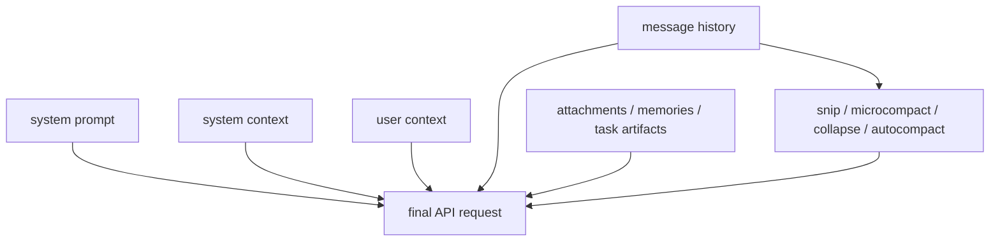

# Context engineering

Context engineering is one of the deepest hidden systems in Claude Code.

If you only look at the surface, it seems simple:

```text
take messages -> send them to the model
```

That is not what the runtime is doing.

Claude Code is constantly deciding:

- which context belongs in the system prompt,
- which context belongs in user-prepended state,
- which messages still matter,
- which tool results are too expensive to keep raw,
- when to compact,
- what to restore after compaction,
- which durable artifacts should be reattached for continuity.

That is why this page matters.

> **Claude Code does not treat context as a blob. It treats context as a managed working set.**

## Why this page matters

The model’s quality depends on what it sees.

But in a long coding session, the raw conversation can easily become too large:

- many file reads,
- many tool results,
- attachments,
- memory injections,
- repeated retries,
- accumulated system guidance.

So the runtime has to solve a product problem:

> how do we keep the model maximally informed without blowing the context window or losing continuity?

That is the job of context engineering.

## Main source anchors

- `src/context.ts`
- `src/utils/api.ts`
- `src/utils/attachments.ts`
- `src/services/compact/compact.ts`
- `src/services/compact/autoCompact.ts`
- `src/memdir/*`

## Context system in one diagram



This is the first thing to remember:

Claude Code sends the model a **composed request**, not just a raw transcript.

## Part 1 — `context.ts` defines the stable context surfaces

`src/context.ts` is one of the clearest examples of “structured context instead of ad-hoc prompt stuffing.”

It separates:

- **system context**
- **user context**

and memoizes both for the conversation.

## Part 2 — system context is environment truth, not free-form notes

### Annotated code: `getGitStatus()`

```ts
const [branch, mainBranch, status, log, userName] = await Promise.all([
  getBranch(),
  getDefaultBranch(),
  execFileNoThrow(gitExe(), ['--no-optional-locks', 'status', '--short']),
  execFileNoThrow(gitExe(), ['--no-optional-locks', 'log', '--oneline', '-n', '5']),
  execFileNoThrow(gitExe(), ['config', 'user.name']),
])
```

### What this means

This is not just “include git info.”

It reveals several product decisions:

- gather multiple environment facts in parallel,
- avoid optional git locks,
- trim status output if it gets too large,
- turn repo state into explicit model-facing context.

### Another important detail

The generated text includes a disclaimer:

```ts
`This is the git status at the start of the conversation. ... it will not update during the conversation.`
```

That matters because it prevents the model from over-trusting stale environment state as if it were live.

So the system context is not only information — it is **information with scope boundaries**.

## Part 3 — user context is more than “the user prompt”

`getUserContext()` is where Claude Code loads project instructions and other user-scoped context material.

### Annotated code

```ts
const shouldDisableClaudeMd =
  isEnvTruthy(process.env.CLAUDE_CODE_DISABLE_CLAUDE_MDS) ||
  (isBareMode() && getAdditionalDirectoriesForClaudeMd().length === 0)

const claudeMd = shouldDisableClaudeMd
  ? null
  : getClaudeMds(filterInjectedMemoryFiles(await getMemoryFiles()))
```

### What this means

This is one of the most important distinctions in the file:

- some sessions should load `CLAUDE.md`,
- some should not,
- bare mode disables implicit discovery unless the user explicitly asked for additional dirs,
- injected memory files are filtered before prompt use.

This is a good example of context engineering as **policy**, not only assembly.

## Part 4 — the API request is assembled, not dumped

In the runtime, the final API payload is composed by combining:

- system prompt,
- system context,
- user context,
- normalized messages,
- attachments and other runtime-injected context.

The important lesson is:

> prompt construction is not one string builder; it is a set of distinct context channels with different lifetimes and trust levels.

## Part 5 — attachments are part of context engineering, not an afterthought

`src/utils/attachments.ts` is extremely important because it shows that the context surface is wider than plain messages.

It handles things like:

- memory file injection,
- task attachments,
- deferred-tool deltas,
- MCP instruction deltas,
- file- and diff-based context artifacts,
- LSP diagnostic attachments,
- transcript-related artifacts in some paths.

That means “context” in Claude Code is not only:

- system prompt,
- plus message history.

It is also a pipeline of **structured attachments and reinjected artifacts**.

## Part 6 — compaction is part of the request path

The strongest signal in the source is that compaction is not a separate maintenance job.

It is part of turn execution.

### Annotated compaction chain


### Why that matters

This means the runtime is constantly managing the working set that goes into the next model call.

It does not wait until “the conversation is too big” in a vague sense.
It actively reshapes context before each expensive call.

## Part 7 — `autoCompact.ts` is the policy layer

This file answers one core question:

> when is context pressure high enough that the runtime must intervene automatically?

### Annotated code

```ts
const MAX_OUTPUT_TOKENS_FOR_SUMMARY = 20_000
export const AUTOCOMPACT_BUFFER_TOKENS = 13_000
export const WARNING_THRESHOLD_BUFFER_TOKENS = 20_000
```

and:

```ts
export function getEffectiveContextWindowSize(model: string): number {
  const reservedTokensForSummary = Math.min(
    getMaxOutputTokensForModel(model),
    MAX_OUTPUT_TOKENS_FOR_SUMMARY,
  )
  ...
  return contextWindow - reservedTokensForSummary
}
```

### What this means

Claude Code does not think in terms of “full context window” only.

It subtracts a reserved budget for the summary path itself, then defines warning/compact/blocking zones relative to that reduced effective window.

That is a very mature design.

It means the system asks:

- not only “how much room do I have?”
- but also “how much room do I need to recover if something goes wrong?”

## Part 8 — `compact.ts` is where continuity is rebuilt

Compaction is not only about making history smaller.

It is also about deciding what must survive after the cut.

The file touches:

- attachments,
- tool-search deltas,
- plan files,
- file restoration,
- memory path handling,
- transcript segments,
- session activity,
- compact boundary messages.

That means compaction is a **continuity-engineering subsystem**, not merely summarization.

## Part 9 — why memory belongs here

`memdir/` is relevant to context engineering because memory is not just long-term storage.

It is also:

- something that must be loaded selectively,
- described compactly,
- indexed for prompt usefulness,
- prevented from taking over the entire working set.

That is why memory and context engineering are adjacent, but not identical:

- memory decides what can persist,
- context engineering decides what should be present **now**.

## Part 10 — the best mental model

The best mental model for Claude Code context is not “history.”

It is:

> **a managed working set made of system facts, project instructions, messages, attachments, memory surfaces, and recovery-aware compaction policy.**

That is why the system can remain coherent over long sessions without blindly feeding the model everything forever.

## What builders should steal

### For beginners

Steal this one idea first:

- context is something you *curate*, not something you merely accumulate.

### For experienced engineers

Steal these deeper ideas:

1. separate system context from user/project context,
2. attach environment truth with explicit staleness framing,
3. treat compaction as part of turn execution,
4. reserve recovery budget inside the effective context window,
5. think of memory as one source of context, not the whole story.

## Teaching takeaway

Claude Code succeeds here because it treats context as a **system design problem**:

- cost,
- latency,
- continuity,
- trust,
- and retrieval

are all negotiated at once.

That is what makes its context engineering worth studying.
