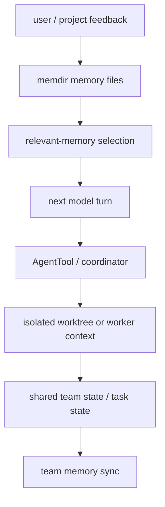

# Memory and multi-agent

Claude Code’s architecture gets much more interesting once you stop thinking only about one turn and one model.

This page is about what happens when the system needs to:

- remember things across sessions,
- reload the right memories into the next turn,
- coordinate more than one agent,
- keep multiple workers from stepping on the same repository state.

That is why memory and multi-agent are grouped together here:

> both are really questions about **durable state and coordination boundaries**.

## Why this page matters

Most toy agent systems assume one conversation, one model, one working directory, one short-lived task.

Claude Code is built to go further:

- durable memory files,
- long-running sessions,
- task-backed background work,
- subagents,
- coordinator mode,
- team memory sync,
- worktree isolation.

So the question is no longer:

> can the model solve the task?

It becomes:

> how does the product keep long-lived state coherent while multiple actors and multiple time horizons are involved?

## Main source anchors

- `src/memdir/memdir.ts`
- `src/memdir/memoryTypes.ts`
- `src/memdir/findRelevantMemories.ts`
- `src/services/teamMemorySync/watcher.ts`
- `src/tools/AgentTool/AgentTool.tsx`
- `src/coordinator/coordinatorMode.ts`

## Memory and multi-agent map



This is the key insight:

Claude Code is not only managing model context.
It is also managing **which durable state belongs to one user, one session, one team, or one worker**.

## Part 1 — memory is designed as a durable, file-based knowledge system

The `memdir/` subsystem is the clearest proof that Claude Code does not treat memory as “some vector database magic.”

It starts from a very inspectable idea:

- memories are files,
- there is an entrypoint index,
- memory types are constrained,
- loading rules are explicit,
- size limits are enforced.

That is a strong product decision because it keeps memory:

- inspectable by humans,
- versionable by convention,
- easier to debug than hidden embeddings-only systems.

## Part 2 — `memoryTypes.ts` shows that memory is intentionally typed

This file is one of the most important architectural anchors for the memory story.

### Annotated code

```ts
export const MEMORY_TYPES = [
  'user',
  'feedback',
  'project',
  'reference',
] as const
```

### What this means

Claude Code does not let memory become an unbounded junk drawer.

It constrains memory into semantic classes:

- **user** — who the user is and how to help them,
- **feedback** — how the user wants the agent to behave,
- **project** — ongoing project state and decisions,
- **reference** — pointers to external systems or information.

That is a very important teaching point:

> memory is not only “save facts.” It is “save the kinds of facts that remain useful and safe over time.”

## Part 3 — `memdir.ts` shows that memory must remain small enough to be useful

This file teaches the practical side of durable memory.

### Annotated code

```ts
export const ENTRYPOINT_NAME = 'MEMORY.md'
export const MAX_ENTRYPOINT_LINES = 200
export const MAX_ENTRYPOINT_BYTES = 25_000
```

### What this means

The memory entrypoint is capped both by:

- line count,
- byte size.

That is a reminder that durable memory is still constrained by prompt economics.

Claude Code is effectively saying:

- memory must exist,
- but memory must also be compact enough to stay load-bearing.

### Another useful fragment

```ts
export const DIR_EXISTS_GUIDANCE =
  'This directory already exists — write to it directly ...'
```

### What this means

The runtime is shaping model behavior around memory operations.

It has learned that otherwise the model wastes turns on:

- `ls`
- `mkdir -p`
- redundant existence checks

So even the memory subsystem includes prompt-level operational guidance to reduce waste.

## Part 4 — memory recall is selective, not “load everything”

`findRelevantMemories.ts` shows how the system avoids stuffing all durable memory into every turn.

### Annotated code

```ts
const result = await sideQuery({
  model: getDefaultSonnetModel(),
  system: SELECT_MEMORIES_SYSTEM_PROMPT,
  ...
})
```

### What this means

Claude Code uses a side-query selection step to choose which memories are actually worth surfacing for a given user query.

That means memory recall itself becomes an architectural subsystem:

- scan memory files,
- format a memory manifest,
- ask a model to pick the most relevant subset,
- return only those paths for the next turn.

This is a great teaching example because it shows that memory is not only storage.
It is also **retrieval discipline**.

## Part 5 — team memory sync shows collaboration is a systems problem

The `teamMemorySync/` area is where multi-agent design starts feeling real.

### Annotated code from `watcher.ts`

```ts
const DEBOUNCE_MS = 2000
let pushInProgress = false
let hasPendingChanges = false
```

### What this means

Team memory is not “just copy files somewhere.”

The runtime has to care about:

- debounce timing,
- overlapping changes,
- sync storms,
- retries,
- permanent-vs-transient failure suppression.

That is exactly why collaborative memory should be taught alongside multi-agent orchestration.

### Another important clue

The watcher includes suppression logic for permanent failures and explicit unlink-based recovery behavior.

That means the product expects shared state to fail in messy, real-world ways — and engineers the memory system accordingly.

## Part 6 — `AgentTool.tsx` shows why multi-agent is more than “spawn another model”

The multi-agent story begins with the `AgentTool`.

What matters architecturally is not only that subagents exist.
It is that the runtime makes explicit choices about:

- worker tool pools,
- permission mode inheritance,
- async vs foreground agent execution,
- worktree isolation,
- remote vs local execution,
- teammate restrictions,
- coordinator-aware behavior.

This is one reason the multi-agent chapter in `how-claude-code-works` is such a useful reference: the real problem is orchestration and isolation, not just fan-out.

## Part 7 — `coordinatorMode.ts` is a role-boundary document disguised as code

This file is one of the most revealing multi-agent files in the repo.

### Annotated code

```ts
const INTERNAL_WORKER_TOOLS = new Set([
  TEAM_CREATE_TOOL_NAME,
  TEAM_DELETE_TOOL_NAME,
  SEND_MESSAGE_TOOL_NAME,
  SYNTHETIC_OUTPUT_TOOL_NAME,
])
```

and:

```ts
if (!isCoordinatorMode()) {
  return {}
}
```

### What this means

Coordinator mode is not just “one more agent type.”

It is a runtime-enforced role boundary:

- workers get a specific capability envelope,
- some tools are reserved as internal coordination tools,
- the prompt and user context are adapted for delegation.

This is a very strong systems lesson:

> role separation in a multi-agent product is healthiest when the runtime helps enforce it, not only the prompt.

## Part 8 — worktrees matter because memory and coordination are not enough

Even if you solve:

- memory recall,
- task state,
- shared coordination,

you still have another problem:

> how do multiple agents avoid trampling the same files?

That is why Claude Code-style systems often rely on worktree or isolated-worker approaches.

The key lesson is:

- memory handles shared knowledge,
- tasks handle shared work identity,
- isolation handles conflicting file effects.

You need all three.

## Part 9 — why this page should eventually split

This current page still groups memory and multi-agent together because the site is mid-transition from overview pages to deeper专题文章.

The roadmap rightly suggests that later the site should likely split into:

- a dedicated memory-system chapter,
- a dedicated multi-agent-architecture chapter.

But teaching them together right now still has value:

both are fundamentally about durable state, retrieval, coordination, and isolation.

## Part 10 — what builders should steal

### For beginners

Steal these ideas:

1. durable memory should be inspectable,
2. not every memory belongs in every turn,
3. multi-agent requires more than parallel model calls,
4. shared state and isolated workspaces solve different problems.

### For advanced readers

Steal these deeper lessons:

1. use typed memory categories instead of one undifferentiated memory dump,
2. keep retrieval selective,
3. treat team memory as a synchronization system with failure modes,
4. enforce role boundaries in the runtime when possible,
5. combine coordination state with filesystem/process isolation.

## Teaching takeaway

Claude Code’s memory and multi-agent story is best understood as:

> **durable state + selective recall + role boundaries + isolation**.

That combination is what lets the system scale from a single helpful session into longer-lived, more collaborative forms of work.
