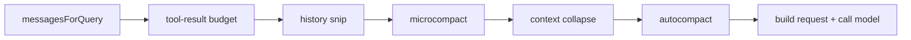

# Runtime loop

If `architecture.md` gives you the top-level map, this page explains the single most important moving part in Claude Code:

> **how one user message becomes a long-running, recoverable, tool-using turn.**

This is where Claude Code stops being “a CLI around an API” and becomes a real agent runtime.

## Why this page matters

Most coding-agent explanations oversimplify the loop into:

```text
user -> model -> tool -> model -> done
```

That is enough to explain the idea. It is not enough to explain a production system.

Claude Code’s runtime loop also has to handle:

- slash-command preprocessing,
- structured state that survives many turns,
- tool-result budgeting,
- streaming output,
- deferred tool execution,
- prompt-too-long recovery,
- compact / collapse / retry decisions,
- permission denials and stop hooks,
- final result extraction for downstream clients.

The source spreads this across two major files:

- `src/QueryEngine.ts` — **session owner**
- `src/query.ts` — **turn state machine**

That split is the key to reading everything else correctly.

## The runtime spine

```mermaid
flowchart TD
  user[User prompt] --> engine[QueryEngine.submitMessage()]
  engine --> process[processUserInput]
  process --> q[query()]
  q --> compact[budget / compact / collapse]
  compact --> api[streaming model call]
  api --> toolstream[StreamingToolExecutor / runTools]
  toolstream --> continue{continue?}
  continue -->|yes| q
  continue -->|no| result[final SDK / UI result]
```

This diagram is deliberately missing a lot of detail. The rest of the page fills it in.

## The most important architecture distinction

Before reading the code, lock this in:

| File | Time horizon | Responsibility |
| --- | --- | --- |
| `QueryEngine.ts` | conversation / session | Owns the long-lived state of one conversation |
| `query.ts` | one turn | Drives the loop, tools, recovery, and continuation logic |

If you miss this distinction, the rest of the runtime looks like one giant messy loop.
If you keep it in mind, the architecture starts to feel surprisingly deliberate.

## Part 1 — `QueryEngine.submitMessage()` owns the session boundary

The first thing to understand is that `submitMessage()` is **not** just “call the model.”

It performs the session-scoped work required before a turn can begin.

### Annotated code: what the engine is configured with

```ts
export type QueryEngineConfig = {
  cwd: string
  tools: Tools
  commands: Command[]
  mcpClients: MCPServerConnection[]
  agents: AgentDefinition[]
  canUseTool: CanUseToolFn
  getAppState: () => AppState
  setAppState: (f: (prev: AppState) => AppState) => void
  initialMessages?: Message[]
  readFileCache: FileStateCache
  customSystemPrompt?: string
  appendSystemPrompt?: string
  userSpecifiedModel?: string
  fallbackModel?: string
  thinkingConfig?: ThinkingConfig
  maxTurns?: number
  maxBudgetUsd?: number
  taskBudget?: { total: number }
}
```

### What this tells us

The engine is the **conversation scaffold** around the main loop.

It carries:

- the environment (`cwd`),
- the action surface (`tools`, `commands`, `mcpClients`, `agents`),
- the UI bridge (`getAppState`, `setAppState`),
- persistent caches (`readFileCache`),
- policy knobs (`maxTurns`, `maxBudgetUsd`, `taskBudget`),
- prompt/model shaping inputs.

So if you ask, “where does the session live?”, the answer is not just “in the messages array.”
The answer is: **inside the engine plus the state/caches/config it coordinates**.

## Part 2 — submitMessage has a real lifecycle

One good way to read the method is as an 8-stage pipeline.

```mermaid
flowchart TD
  start[submitMessage(prompt)] --> setup[1. setup: wrap permissions, load prompts, build contexts]
  setup --> orphan[2. orphaned permission replay]
  orphan --> input[3. processUserInput: slash commands, attachments, message creation]
  input --> persist[4. persist user-side transcript state]
  persist --> localcmd{5. local command only?}
  localcmd -->|yes| localout[return local result]
  localcmd -->|no| loop[6. enter query()]
  loop --> budget{7. post-turn budget checks}
  budget --> final[8. extract final result / metadata]
```

### Why this matters

This structure is doing more than one thing:

- preprocessing user intent,
- synchronizing session state,
- handling local-only commands,
- bridging into the turn state machine,
- and then turning the result back into SDK/UI-facing data.

In other words, `submitMessage()` is the **membrane** between the user-facing session and the internal loop.

## Part 3 — the engine stores long-lived mutable state on purpose

The class keeps several mutable structures:

- `mutableMessages`
- `permissionDenials`
- `readFileState`
- `totalUsage`
- `discoveredSkillNames`
- `loadedNestedMemoryPaths`

That is not accidental. It means the session keeps:

- the evolving conversation,
- usage and budget history,
- file-read deduplication state,
- cross-turn memory/skill bookkeeping,
- permission-denial reporting for SDK consumers.

### Design lesson

A production agent needs **session memory beyond raw chat history**.

Without that, each turn would be forced to rebuild too much from scratch:

- file state,
- denial context,
- usage metrics,
- nested memory triggers,
- discovered workflow hints.

## Part 4 — `query.ts` is a turn state machine, not a request helper

The `query()` function is an async generator:

```ts
export async function* query(
  params: QueryParams,
): AsyncGenerator<StreamEvent | Message | ToolUseSummaryMessage, Terminal>
```

That signature tells you two important things immediately:

1. this function **streams intermediate events** instead of waiting for one final return value,
2. it has an explicit **terminal result type** for how the turn ended.

This is one reason the runtime feels alive: the loop is structurally designed for incremental progress.

## Part 5 — the state object reveals the real runtime concerns

### Annotated code

```ts
type State = {
  messages: Message[]
  toolUseContext: ToolUseContext
  autoCompactTracking: AutoCompactTrackingState | undefined
  maxOutputTokensRecoveryCount: number
  hasAttemptedReactiveCompact: boolean
  maxOutputTokensOverride: number | undefined
  pendingToolUseSummary: Promise<ToolUseSummaryMessage | null> | undefined
  stopHookActive: boolean | undefined
  turnCount: number
  transition: Continue | undefined
}
```

### What this tells us

A small agent loop might track:

- messages
- current model response
- maybe a tool call counter

Claude Code tracks much more because it is built around failure recovery and continuation:

- whether auto-compact state exists,
- whether reactive compact already ran,
- whether output-token recovery already escalated,
- whether a stop hook is active,
- what transition reason caused the previous loop continuation.

This means the runtime is explicitly reasoning about **how the turn is surviving itself**.

That is much closer to an operating system loop than to a naive “retry once if error” pattern.

## Part 6 — compaction and collapse live inside the turn

One of the most important architecture decisions in `query.ts` is where compaction happens.

It happens **inside the turn loop**, before the API request is made.

### Compaction/collapse path



### Why this is a big deal

This means Claude Code is not treating context management as a maintenance job that runs somewhere else.

It is part of the live execution path of every turn:

- shrink or reshape tool outputs,
- collapse staged history,
- maybe summarize aggressively,
- then decide what the model should see now.

That is the right way to think about context engineering:

> not as memory aftercare, but as part of turn execution.

## Part 7 — tool execution is a continuation mechanism

When the model emits tool-use blocks, the runtime does not just execute them and “start over.”

It treats tool use as part of the same turn-control system.

Two paths matter:

- `StreamingToolExecutor`
- `runTools(...)`

### Why there are two paths

Claude Code wants both:

- **interactivity** — surface progress/results as soon as useful,
- **discipline** — preserve ordering and context mutation safety.

So tool execution is not only a capability story. It is a **runtime responsiveness story**.

## Part 8 — continuation reasons are first-class runtime state

The field `transition: Continue | undefined` is one of the best clues in the whole file.

It means Claude Code is not satisfied with “the loop continued.”
It wants to know **why** it continued.

Examples include:

- normal next turn,
- stop-hook mediation,
- token-budget continuation,
- recovery after output-token exhaustion,
- reactive compact retry.

That is architecturally important because it makes the runtime:

- explainable,
- testable,
- easier to debug,
- and easier to extend without hiding control flow in scattered booleans.

## Part 9 — a better way to explain the loop

If you were teaching this runtime to someone else, the best sequence is:

1. `main.tsx` and `init.ts` make the process trustworthy
2. `QueryEngine.ts` makes a session durable
3. `query.ts` makes a turn survivable
4. tools make the turn actionable
5. compact/recovery logic keeps the turn alive under stress

That sequence is more accurate than “prompt → tool → prompt.”

## Part 10 — what builders should steal

### For beginners

Steal the split between:

- startup/setup,
- session ownership,
- turn execution.

Even if your project is small, those are healthy boundaries.

### For experienced engineers

Steal the idea that the runtime loop should explicitly own:

- budget logic,
- compaction,
- continuation reasons,
- structured tool execution,
- recovery surfaces.

That is the difference between a demo loop and a product loop.

## Teaching takeaway

The most important sentence on this page is:

> `QueryEngine.ts` owns the **conversation**, and `query.ts` owns the **turn**.

Once you understand that, many other design choices in Claude Code stop feeling arbitrary.
