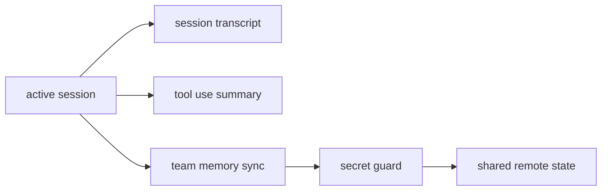

# Session transcripts and team memory

Claude Code contains evidence that long-lived agent work is not represented only as “the current chat history.” The source points to several additional durable artifacts:

- transcript-like session outputs,
- tool-use summaries,
- synchronized team memory,
- secret-guarded shared state.

## Why this subsystem matters

As soon as an agent session becomes:

- long-running,
- collaborative,
- or tool-heavy,

plain in-memory messages are no longer enough.

You need ways to persist, compress, summarize, or synchronize what happened.

## Main source anchors

- `src/services/sessionTranscript/sessionTranscript.ts`
- `src/services/teamMemorySync/index.ts`
- `src/services/teamMemorySync/watcher.ts`
- `src/services/teamMemorySync/teamMemSecretGuard.ts`
- `src/services/toolUseSummary/toolUseSummaryGenerator.ts`

## Architecture sketch



## What is interesting about the transcript path

In this research fork, `sessionTranscript.ts` is exposed only as a stub. That is still useful pedagogically:

- it tells us the product expects a transcript subsystem to exist,
- and other files call into it from compaction/attachment flows,
- which implies transcript handling is part of the real runtime design even if the leaked/stubbed fork does not include its full implementation.

This is an important teaching lesson:

> even a stub can be architectural evidence if the rest of the codebase depends on it.

## What `teamMemorySync/watcher.ts` teaches

This file is much richer and shows what shared memory really means in a product.

### Annotated code fragment

```ts
const DEBOUNCE_MS = 2000
let pushInProgress = false
let hasPendingChanges = false
```

**Annotation**

- Shared memory sync is treated as a file-watching + batching problem.
- Debounce exists because writing every tiny edit immediately would be noisy and expensive.
- `pushInProgress` / `hasPendingChanges` tell us the runtime expects overlapping edits and must serialize sync behavior carefully.

### Another useful fragment

```ts
if (isPermanentFailure(result) && pushSuppressedReason === null) {
  pushSuppressedReason = ...
}
```

**Annotation**

- The runtime distinguishes permanent vs transient sync failures.
- That prevents endless retry loops from shared-dir activity.
- This is very strong production thinking: collaboration systems need backoff and suppression logic, not only optimistic syncing.

## What `teamMemSecretGuard.ts` implies

The presence of a dedicated secret-guard file tells us something important about the product philosophy:

shared memory is **not** automatically safe just because it helps agents collaborate.

Before memory leaves the local boundary, the runtime wants to guard against leaking sensitive data.

That is exactly the kind of safety feature that teaching materials should highlight, because it is easy to forget in toy multi-agent demos.

## What `toolUseSummaryGenerator.ts` teaches

This file shows another durable abstraction layer: summarize a batch of tool work into a short label.

### Annotated code fragment

```ts
const TOOL_USE_SUMMARY_SYSTEM_PROMPT = `Write a short summary label...`
```

and

```ts
const response = await queryHaiku({
  systemPrompt: asSystemPrompt([TOOL_USE_SUMMARY_SYSTEM_PROMPT]),
  userPrompt: `${contextPrefix}Tools completed:\n\n${toolSummaries}\n\nLabel:`,
})
```

**Annotation**

- The runtime does not only keep raw tool results.
- It also creates compact human-readable summaries.
- That improves mobile/compact UI surfaces and likely makes downstream state easier to browse.

This is a powerful design idea:

> durable state should exist at multiple abstraction levels, not only as raw logs.

## Teaching takeaway

### For beginners

Agent memory can live in several forms:

- raw conversation,
- compact summary,
- transcript segment,
- synchronized team memory.

### For advanced readers

The hardest question is not “how do we save more state?”
It is “which representation is safe, useful, and cheap enough for each consumer?”
