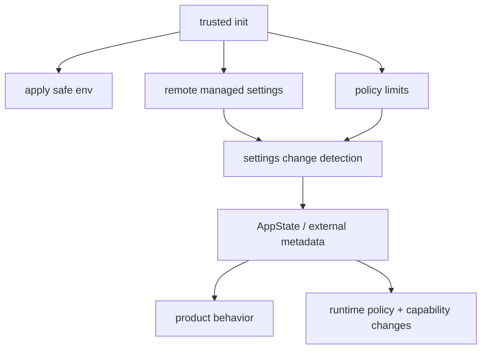

# Settings and remote policy

Claude Code does not treat configuration as a static JSON file that gets read once at startup and then forgotten.

The source shows something much more important:

> **configuration is part of the control plane.**

That control plane decides:

- which environment variables are safe to apply early,
- when remote-managed policy should start loading,
- how policy limits affect the product,
- how settings changes propagate into app state and external metadata,
- how all of that can fail without breaking the whole session.

This page explains that control plane.

## Why this page matters

Many coding-agent projects think about configuration as:

```text
read settings -> use settings
```

Claude Code has to do much more:

- bootstrap policy before the first turn,
- load enterprise-managed settings without deadlocking startup,
- distinguish safe early env application from trust-sensitive behavior,
- propagate setting changes into app state and UI,
- synchronize some settings across environments,
- fail open when management services are down.

That is why this subsystem deserves a full chapter instead of a short survey page.

## Main source anchors

- `src/entrypoints/init.ts`
- `src/services/remoteManagedSettings/index.ts`
- `src/services/policyLimits/index.ts`
- `src/services/settingsSync/index.ts`
- `src/utils/settings/changeDetector.ts`
- `src/state/onChangeAppState.ts`

## Control-plane map



The important thing to notice is that this is not a pure startup chain.
It is a **live control path** that continues affecting the session after startup.

## Part 1 — startup is already policy boot

The first reason this page matters is that policy work begins extremely early.

### Annotated code from `entrypoints/init.ts`

```ts
applySafeConfigEnvironmentVariables()
applyExtraCACertsFromConfig()
setupGracefulShutdown()

if (isEligibleForRemoteManagedSettings()) {
  initializeRemoteManagedSettingsLoadingPromise()
}
if (isPolicyLimitsEligible()) {
  initializePolicyLimitsLoadingPromise()
}

configureGlobalMTLS()
configureGlobalAgents()
preconnectAnthropicApi()
```

### What this means

Before the first real turn exists, the runtime is already deciding:

- which config/env values are safe to apply immediately,
- which network/certificate/policy systems must be ready,
- which remote-control services need a loading promise,
- how cleanup and transport should behave.

This is why startup in Claude Code should be understood as **control-plane boot**, not only application initialization.

## Part 2 — remote managed settings are an enterprise policy service

The `remoteManagedSettings` service is where the control-plane story becomes unmistakable.

### Annotated code

```ts
const SETTINGS_TIMEOUT_MS = 10000
const DEFAULT_MAX_RETRIES = 5
const POLLING_INTERVAL_MS = 60 * 60 * 1000
```

and:

```ts
export function initializeRemoteManagedSettingsLoadingPromise(): void {
  if (loadingCompletePromise) {
    return
  }

  if (isRemoteManagedSettingsEligible()) {
    loadingCompletePromise = new Promise(resolve => {
      loadingCompleteResolve = resolve
      setTimeout(() => {
        if (loadingCompleteResolve) {
          loadingCompleteResolve()
          loadingCompleteResolve = null
        }
      }, LOADING_PROMISE_TIMEOUT_MS)
    })
  }
}
```

### What this means

This file is not merely “fetch some config.”

It is handling:

- eligibility,
- auth mode,
- retries,
- background polling,
- timeout-based deadlock prevention,
- session cache state,
- reload semantics.

That is the shape of an enterprise control-plane client.

### Another key design detail

The service computes a checksum using sorted keys to match server-side hashing rules.

That shows something subtle but important:

> the runtime wants remote settings to behave like a real managed data contract, not an informal blob exchange.

## Part 3 — policy limits are a sibling control-plane service

`policyLimits/index.ts` is easy to overlook because it looks similar to remote-managed settings. That similarity is actually part of the lesson.

### Annotated code

```ts
const CACHE_FILENAME = 'policy-limits.json'
const FETCH_TIMEOUT_MS = 10000
const DEFAULT_MAX_RETRIES = 5
const POLLING_INTERVAL_MS = 60 * 60 * 1000
```

and:

```ts
export function isPolicyLimitsEligible(): boolean {
  if (getAPIProvider() !== 'firstParty') return false
  if (!isFirstPartyAnthropicBaseUrl()) return false
  ...
}
```

### What this means

Claude Code treats policy limits as their own managed service with:

- eligibility checks,
- cache,
- background polling,
- load-completion promises,
- fail-open behavior.

That means the product architecture distinguishes between:

- **settings** — what configuration should be applied,
- **policy limits** — what the product is allowed to do.

That is a very useful teaching distinction for any agent product.

## Part 4 — settings change detection is about coherence, not file watching

One of the deepest lessons in this area is in `changeDetector.ts`.

### Annotated code

```ts
function fanOut(source: SettingSource): void {
  resetSettingsCache()
  settingsChanged.emit(source)
}
```

### What this means

The important design decision is not merely that settings can change.

It is that the runtime:

- resets the cache once,
- then fans out the change,
- instead of letting every listener individually invalidate and reload.

The comments in the source explain why this matters: previous designs caused repeated cache thrash and multiple disk reloads when a single settings change was broadcast to many subscribers.

So this file is really about **runtime coherence under change**.

## Part 5 — settings sync is different from policy loading

`services/settingsSync/index.ts` gives us another control-plane pattern.

### Annotated code

```ts
export function redownloadUserSettings(): Promise<boolean> {
  downloadPromise = doDownloadUserSettings(0)
  return downloadPromise
}
```

### What this means

This one-shot user-triggered refresh path is intentionally different from startup behavior:

- no long retry loop,
- explicit user intention,
- separate download/apply responsibilities,
- caller-managed change notification.

This matters because it shows Claude Code separating:

1. **control-plane fetch/apply**
2. **control-plane change broadcast**

That is how the runtime avoids cycles between sync and change detection.

## Part 6 — app state is where control-plane changes become product behavior

`state/onChangeAppState.ts` is one of the best bridge files in the repo.

### Annotated code

```ts
if (prevMode !== newMode) {
  const prevExternal = toExternalPermissionMode(prevMode)
  const newExternal = toExternalPermissionMode(newMode)
  if (prevExternal !== newExternal) {
    notifySessionMetadataChanged({
      permission_mode: newExternal,
      is_ultraplan_mode: isUltraplan,
    })
  }
  notifyPermissionModeChanged(newMode)
}
```

### What this means

Control-plane state does not stay internal.

It becomes:

- UI state,
- session metadata,
- external bridge/CCR state,
- downstream behavior changes.

This is why app state is not a trivial front-end detail.
It is part of the control plane’s propagation layer.

### Another key bridge

The same file also re-applies environment variables when settings change:

```ts
if (newState.settings.env !== oldState.settings.env) {
  applyConfigEnvironmentVariables()
}
```

This is a perfect example of the control plane influencing the live runtime after startup.

## Part 7 — the most important product lesson

The strongest lesson here is:

> configuration is not only preferences; in a production agent it becomes governance.

And once that happens, you need:

- load-order rules,
- fail-open strategy,
- eligibility logic,
- caching,
- background refresh,
- change propagation,
- UI/state synchronization.

That is exactly what the Claude Code source is showing us.

## Part 8 — what builders should steal

### For beginners

Steal this mental model:

- startup config is part of the product’s trust story,
- not all settings should be treated equally,
- some changes belong to a live control plane instead of a one-time setup step.

### For advanced readers

Steal these design patterns:

1. separate safe-early env application from full configuration application,
2. use loading promises to prevent startup deadlocks,
3. distinguish settings from policy limits,
4. centralize cache invalidation before fan-out,
5. bridge control-plane changes into product/app-state semantics explicitly.

## Teaching takeaway

Claude Code’s settings and policy subsystem is best understood as:

> **a control plane that shapes the runtime before startup, during startup, and throughout a live session.**

That is why it deserves a dedicated chapter instead of being treated as “settings plumbing.”
