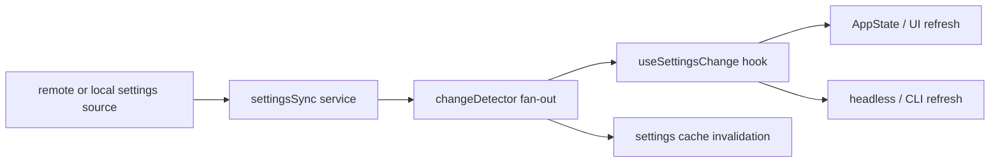

# Settings sync and live refresh

Claude Code does not treat settings as a file that gets loaded once and then forgotten. The source points to a richer model: settings can be downloaded, refreshed, cached, invalidated, and propagated to many parts of the runtime while a session is already alive.

## Why this subsystem is worth studying

If you are building a toy agent, local config is enough.

If you are building a real developer product, settings become much harder:

- some settings arrive from a remote system,
- some settings change mid-session,
- some changes must update UI immediately,
- some changes must avoid creating feedback loops or cache thrash.

That is why Claude Code spreads this topic across several source files instead of treating it like one helper utility.

## Main source anchors

- `src/services/settingsSync/index.ts`
- `src/utils/settings/changeDetector.ts`
- `src/hooks/useSettingsChange.ts`
- `src/state/AppState.tsx`
- `src/cli/print.ts`

## Architecture sketch



## What `settingsSync/index.ts` teaches

The most interesting detail is not “download settings.” It is **how the service behaves when settings need to be refreshed while the product is already running**.

### Annotated code fragment

```ts
export function redownloadUserSettings(): Promise<boolean> {
  downloadPromise = doDownloadUserSettings(0)
  return downloadPromise
}
```

**Annotation**

- `redownloadUserSettings()` exists because startup download is not enough.
- The retry count is forced to `0`, which tells you this path is treated as a **user-triggered refresh**, not a hidden background recovery loop.
- That is a subtle product choice: if a user explicitly asked for refresh, one direct attempt plus a clear failure is often better than opaque retry churn.

### Another important detail

The surrounding comments explain that the caller, not the download helper itself, is responsible for notifying downstream listeners.

That means the design separates:

1. **fetch/apply remote entries**
2. **broadcast change to the rest of the system**

This reduces cycle risk.

## What `changeDetector.ts` teaches

This file contains one of the most educational comments in the codebase: why cache reset must happen in one place instead of in every listener.

### Annotated code fragment

```ts
function fanOut(source: SettingSource): void {
  resetSettingsCache()
  settingsChanged.emit(source)
}
```

**Annotation**

- `resetSettingsCache()` happens before notifying listeners.
- The runtime explicitly avoids letting each listener clear the cache independently.
- Why? Because with N listeners, each one would re-read from disk and trigger repeated invalidation work.

The long comment above this function explains the product lesson clearly:

> notification fan-out is not just an eventing problem — it is also a cache-behavior problem.

## What `useSettingsChange.ts` teaches

This hook is short, but it reveals the intended architecture boundary.

### Annotated code fragment

```ts
const handleChange = useCallback((source: SettingSource) => {
  const newSettings = getSettings_DEPRECATED()
  onChange(source, newSettings)
}, [onChange])
```

**Annotation**

- The hook does **not** reset the cache itself.
- It trusts the notifier path to have already done that.
- This is a nice example of removing defensive duplication once the producer contract is reliable.

In other words, the product learned from an earlier design where too many listeners each tried to “be safe,” and that safety created waste.

## Why this matters for the UI and CLI

`AppState.tsx` and `cli/print.ts` matter because settings changes are not only a data concern. They can affect:

- what the user sees,
- which capabilities are enabled,
- how headless output behaves,
- how plugin- or mode-related logic refreshes.

That means settings are part of the control plane for the whole product.

## Teaching takeaway

### For beginners

Configuration in a serious agent is not only “a JSON file.”
It becomes a **live signal** that the runtime must distribute safely.

### For advanced readers

The key question is not “how do I reload config?”
It is “how do I refresh state across many consumers without loops, cache thrash, or inconsistent ordering?”
