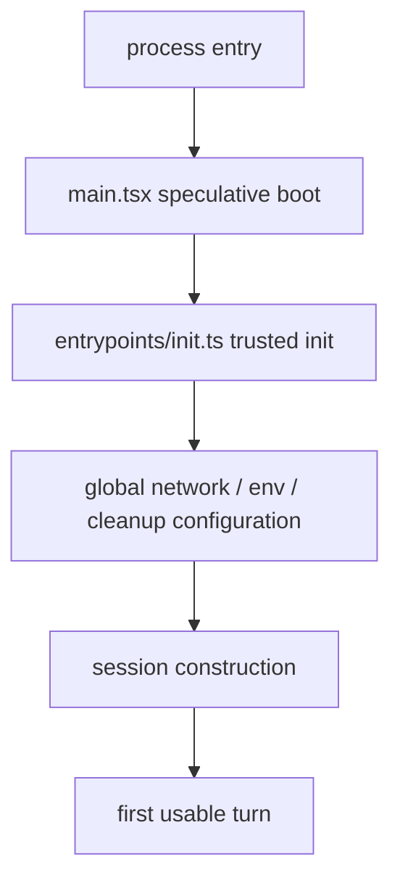

# Startup architecture

This page explains a specific part of Claude Code’s system architecture that is easy to underestimate:

> **startup is already policy, performance, and trust engineering.**

Most readers understand that `query.ts` is important. Fewer realize that many product guarantees are decided *before the first user turn even exists*.

## Why startup deserves its own page

A small project can survive with a single boot file.
Claude Code cannot.

By the time the first prompt appears, the runtime may already have:

- prefetched credentials,
- started reading managed settings,
- configured certificates and proxy agents,
- installed cleanup hooks,
- initialized policy-limit loading,
- warmed network connections,
- chosen which parts of the environment are safe to apply early.

That is not boilerplate. That is architecture.

## Main source anchors

- `src/main.tsx`
- `src/entrypoints/init.ts`
- `src/bootstrap/state.ts`
- `src/utils/managedEnv.js`
- `src/services/remoteManagedSettings/index.ts`
- `src/services/policyLimits/index.ts`

## Startup architecture in one diagram



## Stage 1 — speculative boot in `main.tsx`

Before the full import graph finishes loading, Claude Code already starts overlapping expensive work.

### Annotated code

```ts
profileCheckpoint('main_tsx_entry')
startMdmRawRead()
startKeychainPrefetch()
```

### What this means

This is the first key design choice:

- profile immediately,
- start managed-settings reads early,
- start secure-storage/keychain reads early,
- overlap those waits with the rest of module evaluation.

This is not micro-optimization for its own sake.
It is a product decision: a user experiences startup as one continuous wait, so the runtime tries to compress the critical path before rendering has even fully begun.

## Stage 2 — trusted init in `entrypoints/init.ts`

This is where the system transitions from “speculatively reading things” to “safely installing process-wide behavior.”

### Annotated code

```ts
applySafeConfigEnvironmentVariables()
applyExtraCACertsFromConfig()
setupGracefulShutdown()
if (isEligibleForRemoteManagedSettings()) {
  initializeRemoteManagedSettingsLoadingPromise()
}
if (isPolicyLimitsEligible()) {
  initializePolicyLimitsLoadingPromise()
}
configureGlobalMTLS()
configureGlobalAgents()
preconnectAnthropicApi()
```

### Why this matters

This single stretch of code reveals several startup responsibilities:

1. **safe env first** — not every setting is trusted equally early,
2. **transport setup** — certificates, mTLS, proxies,
3. **future waitpoints** — settings/policy promises are created so later code can await them safely,
4. **shutdown discipline** — cleanup is installed before more subsystems spin up,
5. **latency hiding** — preconnect starts before the first heavy request.

That is why startup should be taught as a control-plane narrative, not just an import sequence.

## Stage 3 — handoff into session ownership

Once startup has prepared the environment, the system can safely construct the session-level world:

- app state,
- tools,
- commands,
- agents,
- model selection,
- memory prompt loading,
- MCP connections,
- permission context.

This is where `QueryEngine.ts` becomes relevant.

A useful teaching boundary is:

- startup makes the **program** trustworthy,
- session creation makes the **conversation** possible.

## Why the split is healthier than one big boot file

If all of this lived in one file, several problems would become harder:

- reasoning about safe-vs-unsafe initialization order,
- testing boot-time policy behavior,
- separating speculative warmup from trusted application,
- understanding where session logic begins.

Claude Code’s startup split is therefore not only cleaner; it is easier to evolve.

## The most important lesson for builders

For beginners:

> startup code is part of the product, not just the scaffolding.

For advanced readers:

> the hidden architecture question is always: which guarantees must exist *before* the first turn, and which can be deferred until the session is live?

That single question explains a surprising amount of Claude Code’s startup structure.
