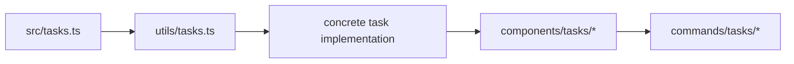

# Tasks and orchestration

As soon as a coding agent grows beyond “answer one question and stop,” it needs a way to represent work that outlives a single model reply.

That is what the task subsystem is for.

This page explains a deeper claim than the previous version:

> **In Claude Code, tasks are not just UI list items. They are durable runtime objects that connect orchestration, persistence, and product visibility.**

## Why this page matters

Without an explicit task model, a coding agent quickly becomes hard to scale:

- background work has nowhere to live,
- delegated work has no durable identity,
- UI progress becomes ad-hoc,
- retries and resumption become brittle,
- multi-agent or teammate flows start trampling each other.

Claude Code treats tasks as first-class runtime state because the product wants to support:

- background shell work,
- local and remote agent work,
- workflow-style execution,
- teammate-aware collaboration,
- UI-visible progress and detail dialogs.

## Main source anchors

- `src/tasks.ts`
- `src/utils/tasks.ts`
- `src/tasks/types.ts`
- `src/commands/tasks/tasks.tsx`
- `src/components/tasks/*`
- `src/tools/AgentTool/*`

## The task subsystem in one diagram

```mermaid
flowchart TD
  kind[task kind registry in src/tasks.ts] --> durable[durable task state in utils/tasks.ts]
  durable --> commands[/tasks command + task tools]
  durable --> ui[components/tasks/*]
  ui --> product[user-visible background work]
  durable --> agents[agent / teammate orchestration]
```

This is the important shift:

the task system is not only “what the UI renders.”
It is also how the runtime gives long-lived work a durable identity.

## Part 1 — `src/tasks.ts` is the task-type registry

This file is easy to underestimate because it looks small.

But architecturally it plays the same role that `tools.ts` plays for tools:

- enumerate the kinds of work the runtime recognizes,
- gate optional task types,
- provide one registry lookup surface.

### Annotated code

```ts
export function getAllTasks(): Task[] {
  const tasks: Task[] = [
    LocalShellTask,
    LocalAgentTask,
    RemoteAgentTask,
    DreamTask,
  ]
  if (LocalWorkflowTask) tasks.push(LocalWorkflowTask)
  if (MonitorMcpTask) tasks.push(MonitorMcpTask)
  return tasks
}

export function getTaskByType(type: TaskType): Task | undefined {
  return getAllTasks().find(t => t.type === type)
}
```

### What this means

The runtime is explicitly saying:

- there are multiple classes of work,
- they are not all equal,
- some are optional,
- and they should be resolved through a central registry rather than through scattered conditionals.

That is already a strong production sign.

A toy agent might only have:

- “shell task”
- maybe “subagent task”

Claude Code already anticipates a richer product space:

- local shell work,
- local agent work,
- remote agent work,
- dream/background work,
- workflow or monitoring tasks behind feature gates.

## Part 2 — `utils/tasks.ts` is the durable coordination layer

If `src/tasks.ts` defines *what kinds of work exist*, `utils/tasks.ts` defines *how task state survives and coordinates across processes*.

This file is where tasks become more than an array in app state.

### Annotated code

```ts
export const TASK_STATUSES = ['pending', 'in_progress', 'completed'] as const
```

and:

```ts
export const TaskSchema = lazySchema(() =>
  z.object({
    id: z.string(),
    subject: z.string(),
    description: z.string(),
    owner: z.string().optional(),
    status: TaskStatusSchema(),
    blocks: z.array(z.string()),
    blockedBy: z.array(z.string()),
  }),
)
```

### What this means

Claude Code treats tasks as explicit domain objects with:

- identity,
- ownership,
- blocking relationships,
- status,
- persistence shape.

This is the moment where “task” becomes a runtime concept rather than an interface affordance.

### Another important fragment

```ts
export function getTaskListId(): string {
  if (process.env.CLAUDE_CODE_TASK_LIST_ID) {
    return process.env.CLAUDE_CODE_TASK_LIST_ID
  }
  const teammateCtx = getTeammateContext()
  if (teammateCtx) {
    return teammateCtx.teamName
  }
  return getTeamName() || leaderTeamName || getSessionId()
}
```

### Why this matters

This function reveals a lot:

- task lists can be explicitly pinned,
- teammates may share the leader’s task list,
- team name can override session identity,
- standalone sessions still get a fallback task identity.

That means the task subsystem is designed to work in:

- a normal single session,
- a team context,
- teammate/coordinator-style flows,
- explicit externally-managed task lists.

This is not “background task support.”
It is **durable coordination infrastructure**.

## Part 3 — file-backed durability is part of the architecture

`utils/tasks.ts` also shows file-backed task persistence:

- task directories,
- sanitized task-list IDs,
- lock files,
- high-water-mark files,
- create/update/reset semantics.

### Annotated code

```ts
const HIGH_WATER_MARK_FILE = '.highwatermark'
```

and

```ts
const LOCK_OPTIONS = {
  retries: {
    retries: 30,
    minTimeout: 5,
    maxTimeout: 100,
  },
}
```

### What this means

The runtime expects:

- multiple concurrent writers,
- task resets,
- the risk of ID reuse bugs,
- the need to serialize critical sections safely.

That is exactly why tasks belong in architecture discussions.

Without this layer, “task” would collapse into a fragile UI convenience.

## Part 4 — task state is a UI seam, not only a storage detail

Now move upward into the product shell.

### Command surface

`src/commands/tasks/tasks.tsx` is tiny, but revealing:

```ts
export async function call(onDone, context): Promise<React.ReactNode> {
  return <BackgroundTasksDialog toolUseContext={context} onDone={onDone} />
}
```

### What this means

The `/tasks` command is not doing ad-hoc work itself.
It delegates to a dedicated product component.

That shows the intended seam:

- runtime produces structured task state,
- product shell decides how to expose it.

### UI surface

`BackgroundTaskStatus.tsx` makes this even clearer. It reads from app state, computes pill labels, teammate views, selection state, and scrolling windows.

This means tasks are a **user-facing abstraction** with:

- footer summaries,
- dialogs,
- teammate views,
- detail panes,
- keyboard-navigation implications.

That is not decoration. It is how the product keeps autonomy observable.

## Part 5 — tasks connect directly to agent orchestration

This is the part many readers miss.

Tasks are not only about shell progress.
They are also where:

- local agents,
- remote agents,
- teammates,
- background activities

become visible and manageable across the product.

That is why the task system belongs in the same mental neighborhood as:

- `AgentTool`,
- teammate context,
- background task dialogs,
- app-state propagation.

### Architecture lesson

The system is using tasks as the bridge between:

1. **runtime work**
2. **durable state**
3. **user-visible orchestration**

This is what makes task state a real architecture seam.

## Part 6 — a better way to teach orchestration

If you only say “Claude Code supports tasks,” you miss the real insight.

The real insight is:

> a task is the smallest durable unit of work the product can track, share, render, and resume.

That makes tasks central to:

- background execution,
- multi-agent expansion,
- progress visibility,
- collaborative or teammate workflows,
- graceful resumption.

## Part 7 — what to study next

If you want to understand this subsystem deeply, follow one task through five layers:



Recommended reading order:

1. `src/tasks.ts`
2. `src/utils/tasks.ts`
3. one concrete task type such as `LocalShellTask` or `LocalAgentTask`
4. `src/components/tasks/*`
5. `src/commands/tasks/tasks.tsx`

That path will teach you more than reading the UI in isolation.

## Teaching takeaway

### For beginners

Tasks answer the question:

> how does an agent keep track of work that lasts longer than one response?

### For advanced readers

The strongest lesson is that Claude Code uses task state as a **durable product boundary**:

- registry-defined,
- file-backed,
- lock-aware,
- app-state visible,
- UI-projected.

That is why the task subsystem belongs in the architecture spine, not as a side note.
