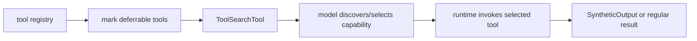

# Tool search and deferred capabilities

Claude Code’s tool layer is more sophisticated than “register every tool and show everything up front.” The source reveals a strategy for **deferring capability exposure** and then letting the model discover or select tools as needed.

## Why this subsystem matters

As agent platforms grow, two problems show up quickly:

1. there are too many tools to expose naively in every request,
2. the runtime sometimes needs more reliable structured output than “please format JSON correctly.”

Claude Code appears to address both with:

- tool search / deferred loading,
- a `StructuredOutput`-style synthetic tool surface.

## Main source anchors

- `src/utils/toolSearch.ts`
- `src/tools/ToolSearchTool/ToolSearchTool.ts`
- `src/services/api/claude.ts`
- `src/utils/messages.ts`
- `src/utils/attachments.ts`
- `src/tools/SyntheticOutputTool/SyntheticOutputTool.ts`

## Architecture sketch



## What `toolSearch.ts` teaches

This file is valuable because it turns tool exposure into a **context-budget decision**, not just a static registry rule.

### Annotated code fragment

```ts
export function getToolSearchMode(): ToolSearchMode {
  const value = process.env.ENABLE_TOOL_SEARCH
  // ...
  return 'tst' // default: always defer MCP and shouldDefer tools
}
```

**Annotation**

- Tool search is configurable, not hardcoded.
- The runtime supports multiple modes (`tst`, `tst-auto`, `standard`).
- That means the product can decide whether deferred discovery is always on, auto-triggered, or disabled.

This is a strong systems lesson:

> “which tools exist?” and “which tools should be exposed right now?” are different questions.

### Budget-awareness detail

The same file also includes threshold logic based on **context window percentage**. This shows that tool-search decisions are tied to prompt budget, not only developer taste.

## What `ToolSearchTool.ts` teaches

This tool makes deferred discovery model-callable.

### Annotated code fragment

```ts
query: z
  .string()
  .describe(
    'Query to find deferred tools. Use "select:<tool_name>" for direct selection, or keywords to search.',
  )
```

**Annotation**

- The tool is not only a search box; it also supports direct selection.
- This reduces friction for the model once it already knows the tool name.
- It is a nice example of turning one capability into both a **search interface** and a **selection interface**.

## What `SyntheticOutputTool.ts` teaches

This file is especially good teaching material because it exposes a runtime philosophy:

sometimes the cleanest way to get structured output is to **treat it like a tool call** rather than trusting raw prose generation.

### Annotated code fragment

```ts
export const SYNTHETIC_OUTPUT_TOOL_NAME = 'StructuredOutput'
```

and

```ts
async call(input) {
  return {
    data: 'Structured output provided successfully',
    structured_output: input,
  }
}
```

**Annotation**

- The runtime names structured output as an explicit capability.
- The tool validates and returns machine-usable output.
- This is a stronger contract than “please emit valid JSON at the end.”

That matters because structured output is really an interface problem, not merely a prompt-writing problem.

## Why API-layer support matters

`services/api/claude.ts` references tool-search-related headers and beta behavior. That is an important reminder:

tool discovery is not only local UX. It can also shape the upstream API request contract.

## Teaching takeaway

### For beginners

Large agent systems need a way to expose power gradually instead of dumping every capability into every prompt.

### For advanced readers

Deferred capabilities and synthetic output show how registry design, prompt budget, and API compatibility all meet at the same architectural seam.
