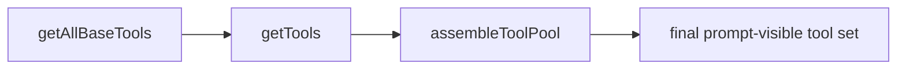
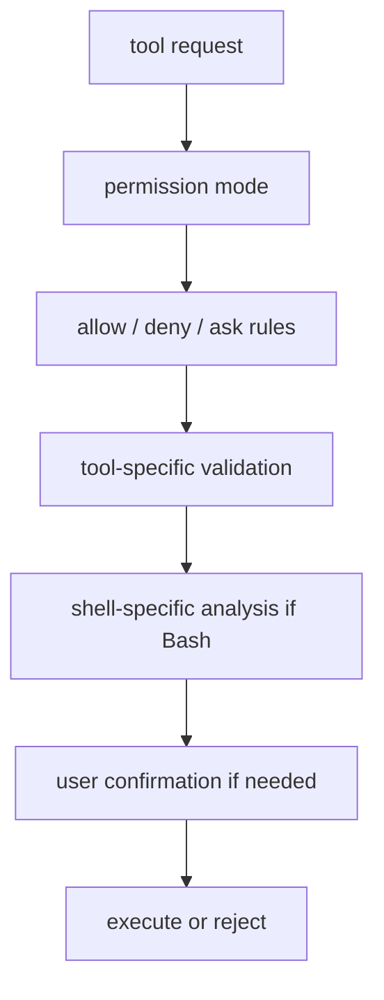

# Tools and permissions

The tool layer is where Claude Code becomes truly useful — and where it becomes dangerous enough that architecture matters.

This page is about a simple but deep idea:

> **Claude Code is not powerful because it has many tools. It is powerful because all of those tools pass through one shared runtime contract, one assembly pipeline, and one layered permission model.**

That is what turns “a model that can call functions” into a coding agent that can work on a real machine without immediately becoming reckless.

## Why this page matters

Almost every serious coding-agent question eventually becomes a tool question:

- how are capabilities defined?
- which tools are visible to the model?
- which tools are allowed right now?
- what can run in parallel?
- how are dangerous operations checked?
- what keeps shell execution from becoming a disaster?

Claude Code answers those questions across a set of related source areas:

- `src/Tool.ts`
- `src/tools.ts`
- `src/services/tools/toolOrchestration.ts`
- `src/services/tools/StreamingToolExecutor.ts`
- `src/tools/BashTool/*`
- `src/utils/permissions/*`

If you understand this page, you understand a big part of why Claude Code feels like a product instead of a toy.

## The tool system in one diagram

```mermaid
flowchart TD
  def[Tool definitions in Tool.ts / tools/*] --> pool[tools.ts assembles tool pool]
  pool --> visible[prompt-visible tools]
  visible --> call[model emits tool_use]
  call --> orchestration[toolOrchestration / StreamingToolExecutor]
  orchestration --> perm[permission + safety checks]
  perm --> exec[tool execution]
  exec --> result[result messages + context updates]
  result --> next[next turn continues]
```

This diagram deliberately compresses several layers into one line. The rest of the page unpacks them.

## Part 1 — `Tool.ts` defines the shared contract

The first important point is that Claude Code does **not** treat every capability as a one-off helper.

Everything is lifted into a common `Tool` contract.

### Annotated code: the contract surface

```ts
export type ToolPermissionContext = DeepImmutable<{
  mode: PermissionMode
  additionalWorkingDirectories: Map<string, AdditionalWorkingDirectory>
  alwaysAllowRules: ToolPermissionRulesBySource
  alwaysDenyRules: ToolPermissionRulesBySource
  alwaysAskRules: ToolPermissionRulesBySource
  isBypassPermissionsModeAvailable: boolean
}>
```

and:

```ts
export type ToolUseContext = {
  options: {
    commands: Command[]
    tools: Tools
    mcpClients: MCPServerConnection[]
    isNonInteractiveSession: boolean
    agentDefinitions: AgentDefinitionsResult
  }
  abortController: AbortController
  readFileState: FileStateCache
  getAppState(): AppState
  setAppState(f: (prev: AppState) => AppState): void
  addNotification?: (notif: Notification) => void
}
```

### What this means

These types tell you that a tool call is **not** just:

```text
input -> handler -> output
```

A tool call happens inside a live runtime that already knows about:

- permission mode,
- app state,
- MCP connections,
- command surfaces,
- file caches,
- agent definitions,
- notifications,
- cancellation.

So a better mental model is:

> a tool is a capability that executes *inside the active session/runtime*, not outside it.

That is why tools can participate in state, not just return data.

## Part 2 — the runtime treats tool visibility as a policy decision

One of the easiest mistakes when reading a coding-agent codebase is to think:

> “there is a registry, therefore the model sees the whole registry.”

Claude Code does not work that way.

It uses a staged tool-pool assembly process.

## Part 3 — `tools.ts` is an assembly pipeline, not a flat list

At first glance, `tools.ts` just looks like a giant import list. But its real structure is much more interesting.

### Tool-pool assembly map



### Stage 1 — `getAllBaseTools()`

This stage answers:

- which built-in tools exist in this build?
- which feature-gated tools are compiled in?
- which optional tools are conditionally loaded?

That means build-time feature gating already shapes the capability surface before the model is ever involved.

### Annotated code: examples from `tools.ts`

```ts
import { BashTool } from './tools/BashTool/BashTool.js'
import { FileReadTool } from './tools/FileReadTool/FileReadTool.js'
import { FileEditTool } from './tools/FileEditTool/FileEditTool.js'
```

and later:

```ts
const WebBrowserTool = feature('WEB_BROWSER_TOOL')
  ? require('./tools/WebBrowserTool/WebBrowserTool.js').WebBrowserTool
  : null
```

### What this means

Some capabilities are foundational and always part of the runtime surface.
Others are explicitly feature-gated and may disappear entirely depending on build or environment.

That is already more productized than “register all possible tools forever.”

### Stage 2 — `getTools(...)`

This stage filters tools based on the current runtime situation.

It can remove or alter visibility based on:

- mode,
- deny rules,
- REPL substitution behavior,
- feature optimism like tool search,
- environment-specific tool enablement.

This is a crucial architectural choice:

> Claude Code does not only reject tools at call time. It also shrinks the model’s visible action space before the prompt is built.

### Stage 3 — `assembleToolPool(...)`

This stage merges:

- built-in tools,
- MCP tools,
- final prompt-visible ordering.

This matters because prompt-visible ordering is not just aesthetics. It can affect:

- stable product surfaces,
- deduplication,
- prompt caching behavior,
- how dynamic tools coexist with built-in ones.

## Part 4 — the tool system distinguishes capability definition from execution policy

The shared contract tells the runtime what a tool **is**.
The orchestration layer tells the runtime how a tool **may run**.

That distinction is one of the best ideas in the whole system.

## Part 5 — `toolOrchestration.ts` is where concurrency becomes policy

This file answers a practical question:

> given multiple tool calls in the same assistant turn, which of them can run together?

### Annotated code

```ts
for (const { isConcurrencySafe, blocks } of partitionToolCalls(
  toolUseMessages,
  currentContext,
)) {
  if (isConcurrencySafe) {
    // Run read-only batch concurrently
  } else {
    // Run non-read-only batch serially
  }
}
```

### What this means

Claude Code does not simply say “parallelize everything.”

Instead it uses tool-level signals like `isConcurrencySafe(...)` to divide work into:

- parallel-safe batches,
- serialized execution paths.

This is the difference between a tool platform and a bag of function calls.

### Why that matters

Without this layer, the runtime would risk:

- conflicting file writes,
- out-of-order context mutation,
- impossible-to-debug races in tool-result handling.

In other words, concurrency here is not a performance detail. It is a correctness policy.

## Part 6 — `StreamingToolExecutor` exists because user experience is part of execution design

The tool system is not only about correctness. It is also about *feel*.

Claude Code wants:

- tools to start early,
- progress to appear quickly,
- results to stay ordered and understandable,
- sibling work to abort cleanly when a failure makes it irrelevant.

That is why a dedicated streaming executor exists at all.

The runtime is trying to hide latency **without losing control**.

## Part 7 — permissions are layered, not monolithic

The permission system is easy to oversimplify into:

```text
if dangerous: ask user
```

That is nowhere near sufficient here.

Claude Code’s permission model combines:

- permission mode,
- allow/deny/ask rule sets,
- tool-specific checks,
- shell-specific semantics,
- runtime context,
- UI confirmation.

## Permission pipeline in one diagram



## Part 8 — Bash is special because it is a capability amplifier

Most tools have bounded semantics.

Shell does not.

With Bash, the model can:

- mutate files,
- delete data,
- reach the network,
- leak secrets,
- spawn new processes,
- chain many subcommands together.

So the runtime does not treat Bash as “just another tool.”

## Part 9 — `bashPermissions.ts` is policy logic, not string matching

This file combines:

- permission rules,
- classifier hooks,
- wrapper handling,
- path constraints,
- mode behavior,
- suggestion generation,
- shell-specific parsing decisions.

### Annotated code

```ts
export const MAX_SUBCOMMANDS_FOR_SECURITY_CHECK = 50
```

### What this means

This is not arbitrary.

The comments explain that extremely large compound-command splits can create pathological work and even event-loop starvation.

So the runtime caps complexity and falls back to a safe default: **ask instead of pretending it fully understands the command**.

That is exactly the kind of production-minded fallback that educational material should emphasize.

## Part 10 — `bashSecurity.ts` is defense in depth

This file contains a long list of specific shell hazards:

- command substitution,
- parameter substitution,
- malformed tokens,
- dangerous redirections,
- zsh-specific expansion tricks,
- comment / quote desynchronization,
- hidden operator cases,
- suspicious Unicode / control characters.

### Annotated code

```ts
const BASH_SECURITY_CHECK_IDS = {
  INCOMPLETE_COMMANDS: 1,
  JQ_SYSTEM_FUNCTION: 2,
  OBFUSCATED_FLAGS: 4,
  DANGEROUS_VARIABLES: 6,
  ZSH_DANGEROUS_COMMANDS: 20,
  COMMENT_QUOTE_DESYNC: 22,
  QUOTED_NEWLINE: 23,
}
```

### What this means

The runtime is not relying on one “dangerous command” regex.

It is modeling many different failure and attack surfaces, because shell risk is multi-dimensional.

That is why the permission system should be taught as a **defense stack**, not as a single modal.

## Part 11 — the biggest architecture lesson

The biggest lesson is not “Claude Code has many tools.”

It is this:

> the system separates **capability definition**, **capability visibility**, **capability execution policy**, and **capability permissioning**.

That separation is what makes the platform extensible without becoming unmanageable.

## Part 12 — what builders should steal

### For beginners

Steal these ideas:

1. define tools with a shared contract,
2. keep execution context explicit,
3. treat shell as special,
4. do not assume all tool calls are concurrency-safe.

### For experienced engineers

Steal these deeper ideas:

1. prompt-visible capability space should be filtered, not only runtime-invocable space,
2. concurrency belongs to orchestration policy, not tool bodies,
3. shell safety needs multiple independent checks,
4. structured output can itself be modeled as a tool contract.

## Teaching takeaway

Claude Code’s tool system is best understood as a **capability plane with policy and product constraints**, not as a toolbox.

That is why it scales from file reads to MCP servers to structured output without collapsing into one giant permission hack.
