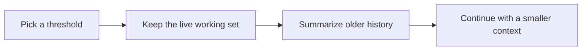

# Lab: compact context

This lab teaches why “just keep appending messages” eventually fails.

## Goal

Add a basic compaction strategy to a minimal agent.

## Minimal target

When token usage or message length crosses a threshold:

1. keep the latest working messages,
2. summarize older messages,
3. replace the older section with the summary,
4. continue the task.

## Step 1 — choose a threshold

You do not need an exact tokenizer at first.

Start with one of:

- message count,
- character count,
- rough token estimate.

## Step 2 — design what survives

Never compact blindly.

Keep:

- the latest user request,
- the most recent assistant reasoning or tool plan,
- recent file/tool results that still matter,
- explicit task constraints.

## Step 3 — add a summary boundary

Your compacted history should make it obvious that a summary replaced older detail.

That makes debugging and recovery much easier.

## Step 4 — compare with Claude Code

Read:

- `src/context.ts`
- `services/compact/autoCompact.ts`
- `services/compact/compact.ts`

Then answer:

- what signals does the production system use that your version ignores?
- what continuity problems appear after compaction?
- what should be restored after summarization?

## Deliverable

Produce:

- your compaction threshold,
- your keep-vs-summarize policy,
- one improvement inspired by Claude Code.

## Continue the lab path

- Previous: [Add a Tool](/labs/add-a-tool)
- Next: [Multi-Agent Readiness](/labs/multi-agent-readiness)
- Deep dive pair: [Context Engineering](/claude-code/context-engineering)
