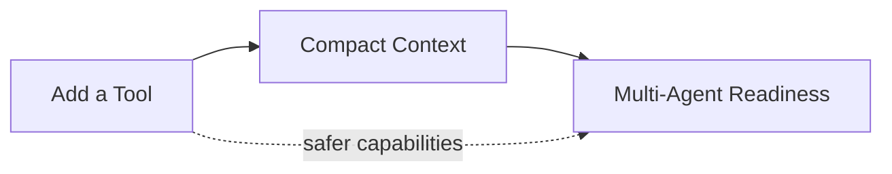

# Labs

Labs turn reading into engineering practice.

## Lab map

## How to use these labs

Each lab is deliberately scoped so you can complete it in a small side project or in a fork of your own agent runtime.

The goal is not to recreate Claude Code line-for-line. The goal is to internalize the **design moves** that make a coding agent reliable.

## Current labs

| Lab                                                  | Core question                                               | Best companion page                                           |
| ---------------------------------------------------- | ----------------------------------------------------------- | ------------------------------------------------------------- |
| [Add a Tool](/labs/add-a-tool)                       | What makes a capability safe enough to expose to the model? | [Tools and Permissions](/claude-code/tools-and-permissions)   |
| [Compact Context](/labs/compact-context)             | How do you stay coherent when the session gets too large?   | [Context Engineering](/claude-code/context-engineering)       |
| [Multi-Agent Readiness](/labs/multi-agent-readiness) | What must exist before delegation is worth it?              | [Memory and Multi-Agent](/claude-code/memory-and-multi-agent) |

Chinese support pages for the same exercises live under [/zh/labs/](/zh/labs/).

## Suggested workflow

For each lab:

1. implement the minimal version,
2. note what breaks,
3. revisit the Claude Code deep-dive page,
4. add one production-inspired refinement.

## Next stop

Pick [Add a Tool](/labs/add-a-tool) if you want the shortest exercise with the clearest runtime-vs-model boundary.
