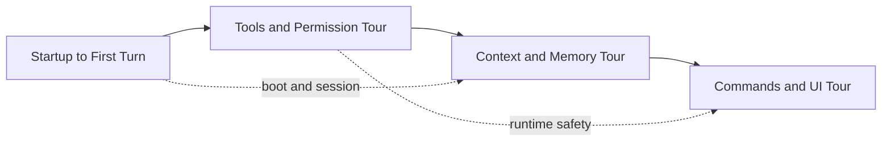

# Source tours

Source tours are for readers who learn best by **following real execution paths** instead of reading isolated concept pages.

## Tour map

## Why these tours exist

Claude Code is large enough that “open the repo and start reading” is inefficient. A source tour narrows the question:

- how does startup become a usable turn?
- where do permissions actually get enforced?
- where does long-context resilience live?
- how do commands and UI fit around the core loop?

## Recommended order

| Step | Tour                                                             | Best for                                   | Follow with                                                         |
| ---- | ---------------------------------------------------------------- | ------------------------------------------ | ------------------------------------------------------------------- |
| 1    | [Startup to First Turn](/source-tours/startup-to-turn)           | boot, session setup, the first usable turn | [Runtime Loop](/claude-code/runtime-loop)                           |
| 2    | [Tools and Permission Tour](/source-tours/tools-permission-tour) | tool registry, orchestration, shell safety | [Tools and Permissions](/claude-code/tools-and-permissions)         |
| 3    | [Context and Memory Tour](/source-tours/context-memory-tour)     | context assembly, memdir, compaction       | [Context Engineering](/claude-code/context-engineering)             |
| 4    | [Commands and UI Tour](/source-tours/commands-ui-tour)           | slash commands, Ink UI, extension surfaces | [Commands, UI, and Extensions](/claude-code/commands-ui-extensions) |

Chinese support pages for the same path live under [/zh/source-tours/](/zh/source-tours/).

## How to use a source tour

For each page:

1. read the diagram and checkpoints,
2. open the referenced files in `../ref_repo/claude-code`,
3. write down the runtime boundary you think the file owns,
4. compare that boundary to the next file in the path.

That turns passive reading into systems understanding.

## Next stop

Start with [Startup to First Turn](/source-tours/startup-to-turn) if you want the shortest path from process boot to agent loop.
