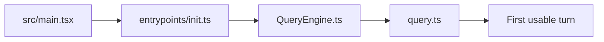

# Source tour: startup to first turn

This tour follows the path from process startup to the first meaningful agent turn.

## The path

`src/main.tsx → entrypoints/init.ts → QueryEngine.ts → query.ts`

The biggest upgrade to your mental model is this:

> Claude Code startup is **not one phase**. It is speculative boot, trusted initialization, deferred warmup, then turn execution.

## 1. Speculative boot in `src/main.tsx`

Start here when you want to answer:

- what gets started before CLI parsing finishes?
- which reads are deliberately overlapped with heavy imports?
- what is on the critical path vs pushed off it?

The top of `main.tsx` does real work before the main action handler runs:

- `profileCheckpoint('main_tsx_entry')` marks the earliest startup boundary,
- `startMdmRawRead()` begins MDM/platform policy reads during module evaluation,
- `startKeychainPrefetch()` begins OAuth + legacy API-key lookups before later settings checks need them.

That means “boot” begins **before** the product has even finished importing itself.

This is the first architectural lesson:

> `main.tsx` is a latency-hiding bootstrapper, not a thin CLI wrapper.

## 2. The `preAction` barrier in `main.tsx`

Later in the same file, `program.hook('preAction', ...)` turns speculative work into a reliable startup barrier.

It explicitly:

- waits for the early MDM + keychain prefetches to finish,
- calls `init()` before command handlers run,
- attaches logging sinks for subcommands,
- runs migrations,
- starts remote-managed settings and policy-limit loading in fail-open background mode.

So the startup story is not “do everything immediately”. It is:

1. start the slow reads early,
2. wait only at the point where their answers become required,
3. keep non-critical refreshes asynchronous.

That pattern appears throughout the product.

## 3. `entrypoints/init.ts` builds the safe control plane

`init.ts` is where Claude Code turns startup into **trusted runtime infrastructure**.

Important details from the source:

- `enableConfigs()` opens the configuration system,
- `applySafeConfigEnvironmentVariables()` runs before trust is established,
- `applyExtraCACertsFromConfig()` happens before the first TLS handshake,
- `setupGracefulShutdown()` is registered early so exits still flush correctly,
- remote-managed settings and policy-limit loading promises are initialized up front,
- `configureGlobalMTLS()` and `configureGlobalAgents()` establish the transport layer,
- `preconnectAnthropicApi()` warms the TCP/TLS path after proxy + cert setup.

This means `init.ts` is not “misc startup plumbing”. It establishes:

- config safety,
- transport safety,
- cleanup guarantees,
- enterprise policy readiness.

There is also a second subtle idea in `initializeTelemetryAfterTrust()`:

- if remote-managed settings are eligible, telemetry waits for them,
- env vars are re-applied after those settings load,
- only then is telemetry initialized.

So even telemetry is treated as **policy-dependent runtime state**, not a fire-and-forget side effect.

## 4. Deferred warmup happens after first render

`main.tsx` also contains `startDeferredPrefetches()`, which is a direct clue about product priorities.

After the initial render, the app warms things that improve the first real turn without blocking the first paint:

- user and system context,
- cloud-provider auth state,
- tips and analytics gates,
- official MCP URLs,
- model capabilities,
- settings and skill change detectors.

This gives you a clean split:

- **critical path startup** = enough state to safely enter the product,
- **deferred warmup** = everything that improves responsiveness once the user is already looking at the UI.

## 5. `QueryEngine.ts` owns the conversation, not just one API call

Next, the system turns “CLI process” into “agent session”.

`QueryEngine` is conversation-scoped. The class keeps persistent state such as:

- `mutableMessages`,
- `permissionDenials`,
- `totalUsage`,
- `readFileState`,
- nested memory / skill-discovery tracking.

That persistence matters because each `submitMessage()` call is only **one turn in an ongoing session**.

Inside `submitMessage()`, the engine:

- resolves the main-loop model + thinking mode,
- fetches system-prompt parts,
- conditionally injects memory mechanics prompts,
- wraps `canUseTool` so denials become SDK-visible state,
- builds `processUserInputContext`,
- records transcript/session state around the loop.

The engineering pattern here is:

> boot logic decides the mode, but `QueryEngine` decides the session contract.

## 6. `query.ts` is the turn state machine

`query.ts` is the control-flow center, but the key detail is *how* it is structured.

The file uses an explicit mutable `State` object carrying fields such as:

- `messages`,
- `toolUseContext`,
- `autoCompactTracking`,
- `maxOutputTokensRecoveryCount`,
- `hasAttemptedReactiveCompact`,
- `pendingToolUseSummary`,
- `turnCount`,
- `transition`.

That makes the loop read like a state machine instead of a pile of nested callbacks.

Read it with these questions:

1. When does the loop trim history (`getMessagesAfterCompactBoundary`, snip, microcompact)?
2. When does it switch from plain sampling to tool execution?
3. When does it continue because of stop-hook blocking, token-budget continuation, or a normal next turn?
4. When does it retry because of `max_output_tokens` or reactive compaction?

If you only read one “hard” file in the repo, this is often the one.

## 7. Why the split matters

Many beginner agent projects collapse all of this into one file. Claude Code does not, because the product has to support:

- speculative startup optimization,
- trust-sensitive policy loading,
- multiple interaction modes,
- persistent conversation state,
- retries and compaction,
- tool streaming,
- UX side effects.

Each layer owns a different kind of time:

- `main.tsx` owns **startup time**,
- `init.ts` owns **trust and infrastructure setup**,
- `QueryEngine.ts` owns **conversation time**,
- `query.ts` owns **turn time**.

## Minimal counterpart

Compare this tour with:

- `../ref_repo/claude-code-from-scratch/src/cli.ts`
- `../ref_repo/claude-code-from-scratch/src/agent.ts`

You should notice that the small project combines what Claude Code separates into boot, session engine, and loop runtime.

## What to write down

After this tour, you should be able to explain:

- why speculative boot exists before `init()`,
- why trusted initialization is separate from deferred warmup,
- why `QueryEngine` sits between CLI startup and `query.ts`,
- where you would add a new startup concern vs a new turn policy.

## Continue the path

- Overview: [Source tours](/source-tours/)
- Next: [Tools and Permission Tour](/source-tours/tools-permission-tour)
- Deep dive pair: [Runtime Loop](/claude-code/runtime-loop)
