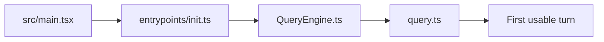

# Source tour: startup to first turn

This tour follows the path from process startup to the first meaningful agent turn.

## The path

`src/main.tsx → entrypoints/init.ts → QueryEngine.ts → query.ts`

## 1. `src/main.tsx`

Start here when you want to answer:

- what gets prefetched?
- what mode is being entered?
- what product systems are initialized before the loop?

Important observations from the source:

- startup profiling is intentionally early,
- keychain/settings reads are started before heavy imports settle,
- commands, plugins, telemetry, and render configuration are all part of “boot”.

This is not a thin CLI wrapper. It is a runtime bootstrapper.

## 2. Session creation in `QueryEngine.ts`

Next, the system turns “CLI process” into “agent session”.

Look for responsibilities such as:

- loading memory prompt material,
- selecting the model and thinking mode,
- preparing file/session caches,
- attaching tool and plugin context,
- recording transcript state.

The engineering pattern here is important:

> boot logic decides the mode, but the engine decides the session contract.

## 3. Turn orchestration in `query.ts`

This file is the control-flow center. Read it with these questions:

1. When do messages get normalized?
2. When do token-budget checks happen?
3. Where do tool calls split the flow?
4. What creates retry vs stop vs compaction?

If you only read one “hard” file in the repo, this is often the one.

## 4. Why the split matters

Many beginner agent projects collapse all of this into one file. Claude Code does not, because the product has to support:

- multiple modes,
- interrupts,
- retries,
- tool streaming,
- context pressure,
- UX side effects.

## Minimal counterpart

Compare this tour with:

- `../ref_repo/claude-code-from-scratch/src/cli.ts`
- `../ref_repo/claude-code-from-scratch/src/agent.ts`

You should notice that the small project combines what Claude Code separates into boot, session engine, and loop runtime.

## What to write down

After this tour, you should be able to explain:

- the difference between startup and turn execution,
- why prefetching exists,
- why a session layer exists between CLI and loop,
- where you would add a new mode or major runtime policy.

## Continue the path

- Overview: [Source tours](/source-tours/)
- Next: [Tools and Permission Tour](/source-tours/tools-permission-tour)
- Deep dive pair: [Runtime Loop](/claude-code/runtime-loop)
