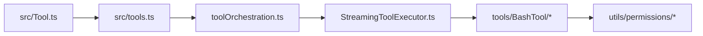

# Source tour: tools and permissions

This tour follows how Claude Code turns model-emitted tool calls into controlled actions.

## The path

`src/Tool.ts → src/tools.ts → services/tools/toolOrchestration.ts → services/tools/StreamingToolExecutor.ts → tools/BashTool/* → utils/permissions/*`

## 1. Shared tool contract

Start in `src/Tool.ts`.

Questions to ask:

- what does every tool need in common?
- what state is threaded across tool calls?
- what belongs in tool context instead of per-tool globals?

The central lesson is that typed, shared contracts make policy possible.

## 2. Registry and capability surface

Then read `src/tools.ts`.

This file answers:

- what tools exist?
- which are feature-gated?
- which are lazily loaded?
- how broad is the runtime capability surface?

It is a product inventory as much as a code file.

## 3. Batching and concurrency

Now inspect `services/tools/toolOrchestration.ts`.

What matters most:

- read-like operations can be grouped,
- mutating operations tend to serialize,
- context modifiers are applied after concurrent execution in a deterministic way.

This is a great example of **performance under correctness constraints**.

## 4. Ordered streaming execution

`StreamingToolExecutor.ts` is where product feel shows up:

- tools can begin while the turn is still unfolding,
- results are buffered,
- output still appears in the order users can understand,
- sibling subprocesses can be aborted on errors.

This is one of the cleanest demonstrations that latency-hiding is a runtime skill, not a model skill.

## 5. Why Bash gets special treatment

Shell access is the riskiest tool class, so follow the trail into:

- `tools/BashTool/bashPermissions.ts`
- `tools/BashTool/bashSecurity.ts`
- `utils/permissions/*`
- `utils/bash/*`

The runtime uses:

- command parsing,
- rule matching,
- mode-aware permission logic,
- misparsing defense,
- many shell-specific security checks.

## Minimal counterpart

Compare with `../ref_repo/claude-code-from-scratch/src/tools.ts`.

That file shows the essence:

- define tool schemas,
- execute them,
- feed results back.

Claude Code shows what is required once the tool layer becomes a trusted product surface.

## What to write down

After this tour, you should be able to explain:

- why tool contracts and execution policy are separate concerns,
- where concurrency is allowed vs denied,
- why shell safety becomes a subsystem instead of an if-statement.

## Continue the path

- Previous: [Startup to First Turn](/source-tours/startup-to-turn)
- Next: [Context and Memory Tour](/source-tours/context-memory-tour)
- Deep dive pair: [Tools and Permissions](/claude-code/tools-and-permissions)
