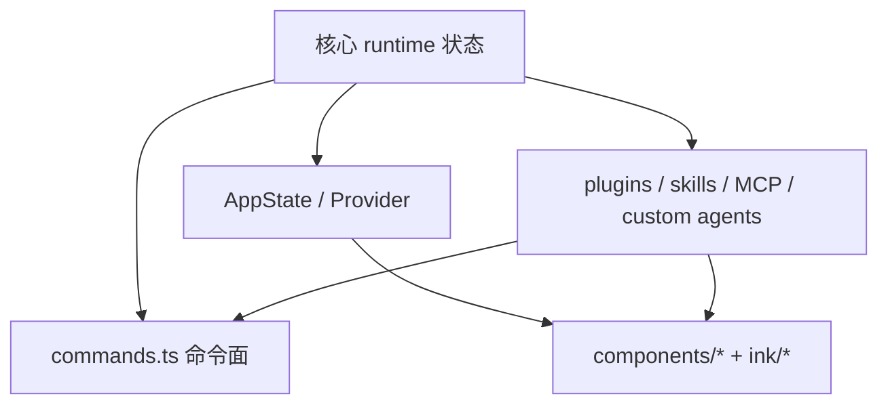

# 命令、界面与扩展

> 这是英文主页面的中文支持页。建议与英文原文对照阅读：[Commands, UI, and Extensions](/claude-code/commands-ui-extensions)

Claude Code 不是只有一个引擎，它还有一个**产品壳（product shell）**。

这一页最重要的一句是：

> **命令、终端 UI、扩展边界，共同把内部 runtime 变成了一个可操作、可观察、可扩展的开发者产品。**

## 产品壳主图



## 为什么 `commands.ts` 很重要

它不是简单的命令列表，而是在定义产品愿意暴露给用户的“显式动词”。

### 注解代码片段

```ts
import memory from './commands/memory/index.js'
import mcp from './commands/mcp/index.js'
import review from './commands/review.js'
import skills from './commands/skills/index.js'
import tasks from './commands/tasks/index.js'
import plugin from './commands/plugin/index.js'
```

**注解**

这说明 Claude Code 不把所有能力都藏在 prompt 后面。
它刻意把一部分能力提升成产品层的显式命令。

## 为什么 UI 不只是“显示层”

`components/App.tsx` 和 `ink/components/App.tsx` 说明：

- UI 依赖 app state / stats / fps 等全局上下文
- 终端壳还处理 raw mode、cursor、focus、selection、click、keyboard dispatch

这说明终端 UI 本身就是一个 interaction runtime，而不是简单打印输出。

## 为什么扩展层要单独讲

Claude Code 没有把“扩展”做成一个单一抽象，而是分成：

- Commands
- Skills
- Plugins
- MCP
- Custom agents

这说明它不是想用一个万能机制包打天下，而是给不同扩展目标设计不同边界。

## 为什么这页重要

如果只看 loop 和 tools，你只能理解 Claude Code“怎么运行”。
如果把命令、UI、扩展一起看，你才能理解 Claude Code“为什么像一个完整产品”。

## 推荐结合阅读

- 英文正文：[Commands, UI, and Extensions](/claude-code/commands-ui-extensions)
- 配套深潜：[工具与权限](/zh/claude-code/tools-and-permissions)
- 配套深潜：[启动架构](/zh/claude-code/startup-architecture)
