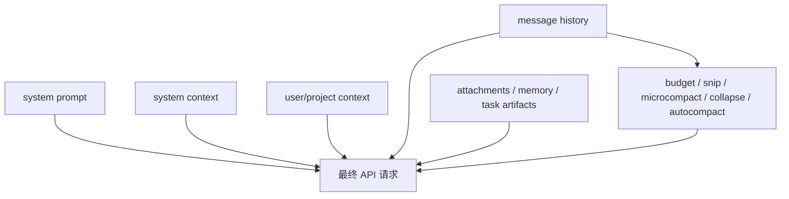

# 上下文工程

> 这是英文主页面的中文支持页。建议与英文原文对照阅读：[Context Engineering](/claude-code/context-engineering)

Claude Code 不把上下文当成一团随手拼接的大字符串，而是把它当成一个**被管理的工作集（managed working set）**。

## 上下文系统主图



## 为什么 `context.ts` 值得读

它不是简单地“拼字符串”，而是在分离两类上下文：

- system context
- user context

### 注解代码片段：`getGitStatus()`

```ts
const [branch, mainBranch, status, log, userName] = await Promise.all([...])
```

**注解**

这说明运行时把 Git 环境视为一类重要上下文，而且还要：

- 并行收集
- 控制长度
- 明确告诉模型这只是快照，不会自动更新

所以 system context 在这里是“环境真相”，不是随手加一点背景说明。

## `getUserContext()` 教的是什么

```ts
const shouldDisableClaudeMd =
  isEnvTruthy(process.env.CLAUDE_CODE_DISABLE_CLAUDE_MDS) ||
  (isBareMode() && getAdditionalDirectoriesForClaudeMd().length === 0)
```

**注解**

这里真正重要的是策略边界：

- 哪些会话应该加载 `CLAUDE.md`
- 哪些会话不该自动加载
- bare mode 与显式 `--add-dir` 的语义如何区分

这说明“是否把某类信息送进上下文”本身就是运行时政策。

## compaction 为什么属于主循环

Claude Code 会在发送请求前依次处理：

- tool-result budget
- snip
- microcompact
- context collapse
- autocompact

这说明：

> 上下文压缩不是后处理，而是 turn 执行的一部分。

## `autoCompact.ts` 在教什么

它不仅问“上下文还有多少空间”，还问：

- 为 summary/recovery 预留了多少空间
- 什么时候 warning
- 什么时候自动 compact
- 什么时候进入 blocking limit

这说明系统是按**有效窗口（effective context window）**思考的，而不是生硬地拿模型总窗口做判断。

## `attachments.ts` 为什么很重要

它提醒我们：Claude Code 的上下文不只有聊天消息。
它还可能包含：

- memory file 注入
- task artifacts
- deferred tool deltas
- MCP instructions deltas
- diagnostics attachments

所以更准确的理解是：

> Claude Code 构造的是一个多通道上下文请求，而不是单纯拼接 message history。

## 最重要的一句总结

Claude Code 的上下文工程，本质上是：

> **在成本、连续性、恢复能力和信息价值之间，持续管理“现在该让模型看到什么”。**

## 推荐结合阅读

- 英文正文：[Context Engineering](/claude-code/context-engineering)
- 配套深潜：[运行时主循环](/zh/claude-code/runtime-loop)
- 配套深潜：[会话转录与团队记忆](/zh/claude-code/session-transcripts-and-team-memory)
