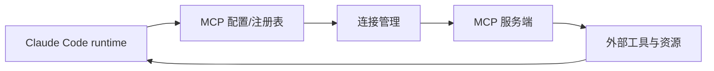

# MCP 与外部工具

MCP 让 Claude Code 不只局限在本地文件与 shell 工具，而是能连接到外部工具与资源生态。

## 建议对照的源码位置

- `src/services/mcp/client.ts`
- `src/services/mcp/MCPConnectionManager.tsx`
- `src/services/mcp/config.ts`
- `src/services/mcp/types.ts`
- `src/services/mcp/officialRegistry.ts`

## 这部分真正重要的点

不是“怎么远程调一个工具”这么简单，而是：连接怎样建立、配置怎样表达、鉴权怎样处理，以及这些外部能力怎样仍然服从统一运行时规则。

