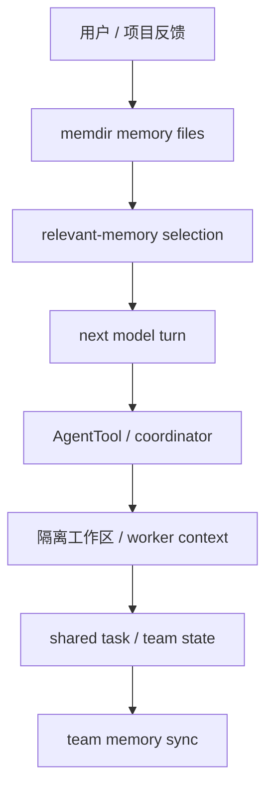

# 记忆与多智能体

> 这是英文主页面的中文支持页。建议与英文原文对照阅读：[Memory and Multi-Agent](/claude-code/memory-and-multi-agent)

Claude Code 真正复杂的地方，不只是“会不会调用工具”，而是它如何处理**跨轮次、跨会话、跨 agent 的持久状态与协作边界**。

这一页最重要的一句是：

> **记忆与多智能体的本质问题，都是 durable state、selective recall、coordination 与 isolation。**

## 结构图



## 为什么 `memoryTypes.ts` 很关键

### 注解代码片段

```ts
export const MEMORY_TYPES = [
  'user',
  'feedback',
  'project',
  'reference',
] as const
```

**注解**

这说明 Claude Code 并不把 memory 当作一个无限的“知识垃圾桶”，而是强制把它分成闭集类型：

- `user`
- `feedback`
- `project`
- `reference`

这背后的设计意义是：

- 记忆必须可解释
- 记忆必须可筛选
- 记忆不能无限膨胀成“什么都存”

## 为什么 `memdir.ts` 不只是文件管理

这个文件告诉我们，memory 不是“存下来就好”，而是还要控制：

- 入口文件 `MEMORY.md`
- line / byte 截断上限
- auto-memory 目录
- team-memory 相关分支
- prompt 里的记忆使用指导

所以 memory 在这里既是存储问题，也是 prompt/runtime 协同问题。

## 为什么 `findRelevantMemories.ts` 很重要

它说明 Claude Code 不是每次都把所有记忆都塞给模型，而是会先做一次**相关性选择**。

### 注解代码片段

```ts
const result = await sideQuery({
  model: getDefaultSonnetModel(),
  system: SELECT_MEMORIES_SYSTEM_PROMPT,
  ...
})
```

**注解**

这意味着记忆系统不仅有“保存”，还有“检索决策”。

也就是说：

> memory 不是只有 storage，还有 retrieval discipline。

## 为什么 team memory sync 值得单独看

`teamMemorySync/watcher.ts` 让你看到共享记忆其实是一个同步系统，而不是简单文件复制。

### 注解代码片段

```ts
const DEBOUNCE_MS = 2000
let pushInProgress = false
let hasPendingChanges = false
```

**注解**

这说明系统在认真处理：

- 去抖
- 重叠写入
- 推送中的状态
- retry / suppression

也就是说，shared memory 本质上是一个协作同步问题。

## 为什么多智能体不是“多开几个模型”

`AgentTool.tsx` 与 `coordinatorMode.ts` 的意义在于：

- worker 的工具池不是随便继承的
- 有前台 / 后台 agent 区分
- 有 coordinator mode 这种 runtime enforced role boundary
- 有 worktree / fork / remote 等不同隔离方式

这说明 Claude Code 的多智能体系统真正关注的是：

- 角色分离
- 状态共享
- 文件冲突避免
- 权限与工具边界

## 最重要的一句总结

Claude Code 的记忆与多智能体，不该理解成两个松散功能点，而应该理解成：

> **让长期工作、协作工作和多主体工作仍然可控的状态与边界系统。**

## 推荐结合阅读

- 英文正文：[Memory and Multi-Agent](/claude-code/memory-and-multi-agent)
- 配套深潜：[任务与编排](/zh/claude-code/tasks-and-orchestration)
- 配套深潜：[上下文工程](/zh/claude-code/context-engineering)
