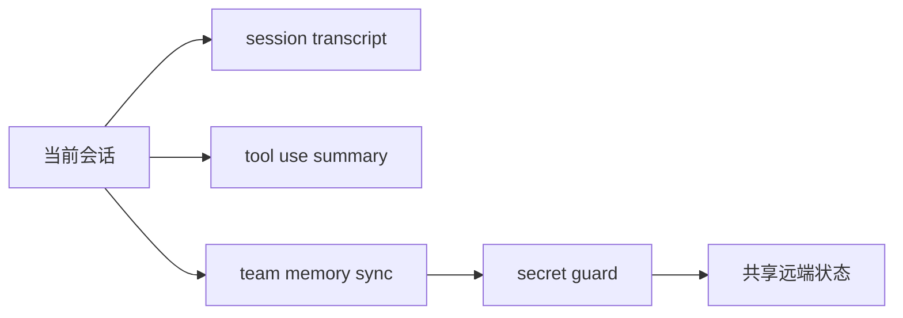

# 会话转录与团队记忆

Claude Code 的源码显示：长期运行 agent 的状态，不只是“聊天记录”一种形式，还可能被保存成转录、摘要或团队同步记忆。

## 建议对照的源码位置

- `src/services/sessionTranscript/sessionTranscript.ts`
- `src/services/teamMemorySync/index.ts`
- `src/services/teamMemorySync/watcher.ts`
- `src/services/teamMemorySync/teamMemSecretGuard.ts`
- `src/services/toolUseSummary/toolUseSummaryGenerator.ts`

## 架构图



## 这部分真正重要的点

真正的生产系统往往需要：

- 持久化转录，
- 工具使用摘要，
- 团队共享记忆，
- 在同步前做 secret guard。

## 注解代码片段

```ts
const DEBOUNCE_MS = 2000
let pushInProgress = false
let hasPendingChanges = false
```

**注解**

- watcher 并不会每次文件改动都立即同步。
- 它显式处理“去抖 + 正在推送 + 待处理改动”这类真实协作问题。

```ts
const TOOL_USE_SUMMARY_SYSTEM_PROMPT = `Write a short summary label...`
```

**注解**

- 说明系统不仅保存原始工具输出，还会主动生成更短、更适合 UI 呈现的摘要层。
- durable state 在这里至少有：原始日志、摘要、同步记忆三种形态。

## 教学意义

- 对初学者：agent 状态不只有聊天记录。
- 对资深工程师：关键问题是谁消费哪种状态，以及同步时怎样防止泄露和重试风暴。
