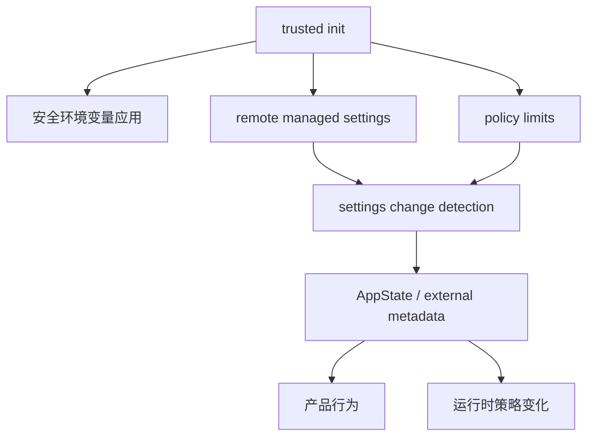

# 设置与远程策略

> 这是英文主页面的中文支持页。建议与英文原文对照阅读：[Settings and Remote Policy](/claude-code/settings-and-remote-policy)

Claude Code 不把设置当成“读一次就完了”的配置文件，而是把它当成一个**控制平面（control plane）**。

这一页最重要的一句是：

> **配置、远程托管设置、策略限制、变更传播，一起组成了 Claude Code 的运行时治理面。**

## 控制平面主图



## 为什么 `init.ts` 很重要

### 注解代码片段

```ts
applySafeConfigEnvironmentVariables()
applyExtraCACertsFromConfig()
setupGracefulShutdown()
if (isEligibleForRemoteManagedSettings()) {
  initializeRemoteManagedSettingsLoadingPromise()
}
if (isPolicyLimitsEligible()) {
  initializePolicyLimitsLoadingPromise()
}
configureGlobalMTLS()
configureGlobalAgents()
preconnectAnthropicApi()
```

**注解**

这说明启动阶段已经在做控制平面工作：

- 先应用安全环境变量
- 初始化远程设置 / 策略限制的加载 promise
- 配置证书、mTLS、代理
- 提前预热 API 连接

也就是说，启动本身已经是“策略与信任边界”的建立过程。

## 为什么 remote managed settings 不是“拉个配置”那么简单

`remoteManagedSettings/index.ts` 里能看到：

- eligibility 检查
- checksum
- cache
- retry/backoff
- background polling
- security check
- loading promise timeout

这说明它本质上更像一个**企业策略服务客户端**，而不是简单 fetch 配置。

## 为什么 policy limits 要单独理解

`policyLimits/index.ts` 与 remote-managed settings 很像，但它们不是一回事：

- settings 更像“应用什么配置”
- policy limits 更像“产品允许做什么”

这两者共同构成 control plane。

## 为什么 `changeDetector.ts` 体现的是 coherence，而不是 watcher 小工具

### 注解代码片段

```ts
function fanOut(source: SettingSource): void {
  resetSettingsCache()
  settingsChanged.emit(source)
}
```

**注解**

关键点不是“监听到了变化”，而是：

- 先统一清缓存
- 再统一 fan-out
- 避免每个 listener 各自 reset cache 导致 thrash

所以它解决的是**运行时一致性问题**。

## 为什么 `settingsSync` 跟远程策略不是同一层概念

`settingsSync/index.ts` 更偏向：

- 同步用户设置
- 用户主动刷新
- apply 与 notify 分离

这说明 Claude Code 把：

- 配置同步
- 政策加载
- 变化广播

拆成了不同职责。

## 为什么 `onChangeAppState.ts` 很关键

它说明控制平面最终会进入：

- app state
- permission mode
- external session metadata
- env 重新应用

也就是说，设置变化不是“内部小更新”，而是会影响整个产品壳的行为。

## 最重要的一句总结

Claude Code 的设置与远程策略，不该理解成配置管理，而应理解成：

> **在启动前、启动中、会话运行中持续影响运行时行为的控制平面。**

## 推荐结合阅读

- 英文正文：[Settings and Remote Policy](/claude-code/settings-and-remote-policy)
- 配套深潜：[启动架构](/zh/claude-code/startup-architecture)
- 配套深潜：[设置同步与实时刷新](/zh/claude-code/settings-sync-and-live-refresh)
