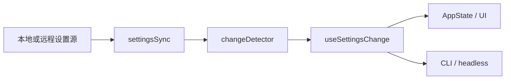

# 设置同步与实时刷新

Claude Code 并不把设置当成“启动时读一次”的静态文件，而是支持中途刷新、同步与分发的运行时模型。

## 建议对照的源码位置

- `src/services/settingsSync/index.ts`
- `src/utils/settings/changeDetector.ts`
- `src/hooks/useSettingsChange.ts`
- `src/cli/print.ts`
- `src/state/AppState.tsx`

## 架构图



## 这部分真正重要的点

真实产品里，设置常常会变成一种事件流：

- 远程同步进来，
- 驱动缓存失效，
- 通知 UI 和后台服务，
- 还要避免循环触发。

## 注解代码片段

```ts
export function redownloadUserSettings(): Promise<boolean> {
  downloadPromise = doDownloadUserSettings(0)
  return downloadPromise
}
```

**注解**

- 这不是启动时的一次性读取，而是**会话中途刷新**。
- 参数 `0` 说明这里不是后台重试路径，而是用户显式触发的一次刷新尝试。

```ts
function fanOut(source: SettingSource): void {
  resetSettingsCache()
  settingsChanged.emit(source)
}
```

**注解**

- 先统一清缓存，再统一通知监听者。
- 这样可以避免每个 listener 各自 reset cache，造成 N 次重复磁盘读取。

## 教学意义

- 对初学者：配置不只是文件，也可能是运行时信号。
- 对资深工程师：最关键的是缓存失效、事件分发顺序和循环依赖控制。
