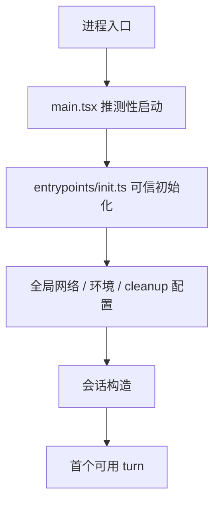

# 启动架构

> 这是英文主页面的中文支持页。建议与英文原文对照阅读：[Startup Architecture](/claude-code/startup-architecture)

Claude Code 的启动阶段并不是普通 CLI 的“读配置然后进入主函数”。它在第一轮对话开始之前，就已经在做**性能、信任和控制平面**相关的关键工作。

## 建议对照的源码位置

- `src/main.tsx`
- `src/entrypoints/init.ts`
- `src/bootstrap/state.ts`

## 启动架构图

## 这页真正要你看懂什么

### 1. `main.tsx` 不是普通入口文件

它会在重型 import 全部完成前，就提前启动一些 IO：

- profiling
- MDM 设置读取
- keychain / credential 预取

这说明启动阶段本身就已经在做**关键路径压缩**。

### 2. `entrypoints/init.ts` 是“可信初始化”边界

这里的重点不是“做初始化”，而是：

- 哪些环境变量可以先安全应用
- 哪些策略/远程设置需要尽早开始加载
- 哪些全局网络能力（CA、mTLS、proxy）必须在真正请求前就位
- 怎样保证 graceful shutdown 与 scratchpad 等基础设施可用

### 3. 会话与启动不是一回事

启动负责让程序“安全可运行”，
会话构造负责让 Agent“开始拥有一段对话”。

这就是为什么后面还需要 `QueryEngine.ts`：
它承担的是 session owner，而不是启动脚本。

## 推荐结合阅读

- 英文正文：[Startup Architecture](/claude-code/startup-architecture)
- 深潜配套：[架构总览](/zh/claude-code/architecture)
- 配套 source tour：[启动到首个回合](/zh/source-tours/startup-to-turn)
