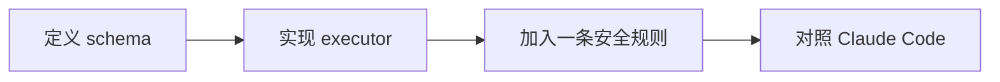

# 实验支持页：添加一个工具

> 这是英文主页面的中文支持页。建议与英文原文对照阅读：[Add a Tool](/labs/add-a-tool)

## 实验流程图

## 这个实验真正要学什么

不是“会写一个函数”就够了，而是理解：为什么一个给模型调用的能力，必须先被运行时包装成可验证、可限制、可组合的工具。

## 最低完成线

- 工具有名字、描述和输入结构。
- 能把结果回送给主循环。
- 至少加一条运行时保护规则。

## 推荐对照页

- 英文原文：[Add a Tool](/labs/add-a-tool)
- 深潜配套：[工具与权限](/zh/claude-code/tools-and-permissions)

## 下一步

继续读：[压缩上下文](/zh/labs/compact-context)
