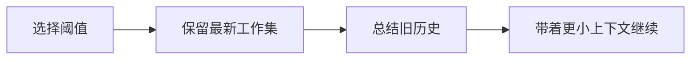

# 实验支持页：压缩上下文

> 这是英文主页面的中文支持页。建议与英文原文对照阅读：[Compact Context](/labs/compact-context)

## 实验流程图

## 这个实验真正要学什么

要学的是：长上下文不是“多塞一点 token”这么简单，而是要区分哪些信息必须活着、哪些可以被抽象、哪些需要在压缩后恢复。

## 最低完成线

- 先定义一个触发阈值。
- 明确 keep vs summarize 的边界。
- 让压缩后的历史对调试者仍然可读。

## 推荐对照页

- 英文原文：[Compact Context](/labs/compact-context)
- 深潜配套：[上下文工程](/zh/claude-code/context-engineering)

## 下一步

继续读：[多智能体准备度](/zh/labs/multi-agent-readiness)
