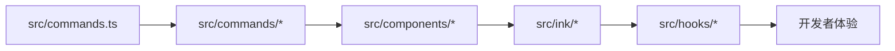

# 源码导览：命令与界面

> 这是英文主页面的中文支持页。建议与英文原文对照阅读：[Commands and UI Tour](/source-tours/commands-ui-tour)

## 路径图

## 这条路径在回答什么

它回答的是：Claude Code 怎样从“内部循环”长成“可被开发者持续使用的终端产品”。

## 阅读时重点看

1. 为什么 `src/commands.ts` 之外还需要单独的命令实现目录。
2. `src/components/*` 与 `src/ink/*` 如何共同承担终端 UI。
3. `src/hooks/*` 怎样把扩展点放在运行时和界面之间。
4. 为什么“用户信任”既是 UI 设计问题，也是运行时设计问题。

## 推荐对照页

- 英文原文：[Commands and UI Tour](/source-tours/commands-ui-tour)
- 深潜配套：[命令、界面与扩展](/zh/claude-code/commands-ui-extensions)

## 下一步

回到总览：[源码导览](/zh/source-tours/)
