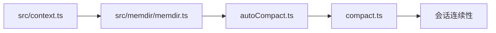

# 源码导览：上下文与记忆

> 这是英文主页面的中文支持页。建议与英文原文对照阅读：[Context and Memory Tour](/source-tours/context-memory-tour)

## 路径图

## 这条路径在回答什么

它回答的是：Claude Code 怎样把上下文装配、文件化记忆、自动压缩与会话连续性连接成一个长期运行系统，而不是单纯堆聊天记录。

## 阅读时重点看

1. `src/context.ts` 如何组织系统上下文、用户上下文与项目指令。
2. `memdir` 怎样把记忆变成对人和模型都可检查的文件结构。
3. `autoCompact.ts` 依据什么阈值决定“该压缩了”。
4. `compact.ts` 怎样在总结历史的同时保住任务连续性。

## 推荐对照页

- 英文原文：[Context and Memory Tour](/source-tours/context-memory-tour)
- 深潜配套：[上下文工程](/zh/claude-code/context-engineering)

## 下一步

继续读：[命令与界面导览](/zh/source-tours/commands-ui-tour)
