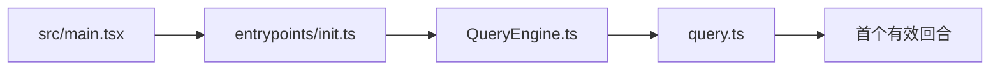

# 源码导览：启动到首个有效回合

> 这是英文主页面的中文支持页。建议与英文原文对照阅读：[Startup to First Turn](/source-tours/startup-to-turn)

## 路径图

## 这条路径在回答什么

它回答的是：Claude Code 为什么不是一个“套 API 的薄 CLI”，而是一个先做启动编排、再建会话、最后进入主循环的产品运行时。

## 阅读时先盯住三件事

1. `src/main.tsx` 里有哪些东西在主循环开始前就被初始化。
2. `QueryEngine.ts` 怎样把“命令行进程”变成“带状态的 agent 会话”。
3. `query.ts` 在哪里做消息规范化、预算检查、工具分流与重试判断。

## 推荐对照页

- 英文原文：[Startup to First Turn](/source-tours/startup-to-turn)
- 深潜配套：[运行时主循环](/zh/claude-code/runtime-loop)

## 下一步

继续读：[工具与权限导览](/zh/source-tours/tools-permission-tour)
