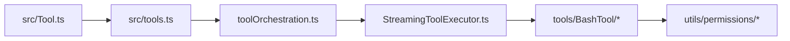

# 源码导览：工具与权限

> 这是英文主页面的中文支持页。建议与英文原文对照阅读：[Tools and Permission Tour](/source-tours/tools-permission-tour)

## 路径图

## 这条路径在回答什么

它回答的是：模型发出的工具调用，怎样被运行时变成“可控、可审计、可中止”的真实动作。

## 阅读时重点看

1. `src/Tool.ts` 怎样定义共享工具契约与上下文。
2. `src/tools.ts` 如何体现能力面、懒加载与特性开关。
3. `toolOrchestration.ts` 怎样决定哪些调用能并发，哪些必须串行。
4. 为什么 Bash 要单独拥有权限与安全子系统。

## 推荐对照页

- 英文原文：[Tools and Permission Tour](/source-tours/tools-permission-tour)
- 深潜配套：[工具与权限](/zh/claude-code/tools-and-permissions)

## 下一步

继续读：[上下文与记忆导览](/zh/source-tours/context-memory-tour)
